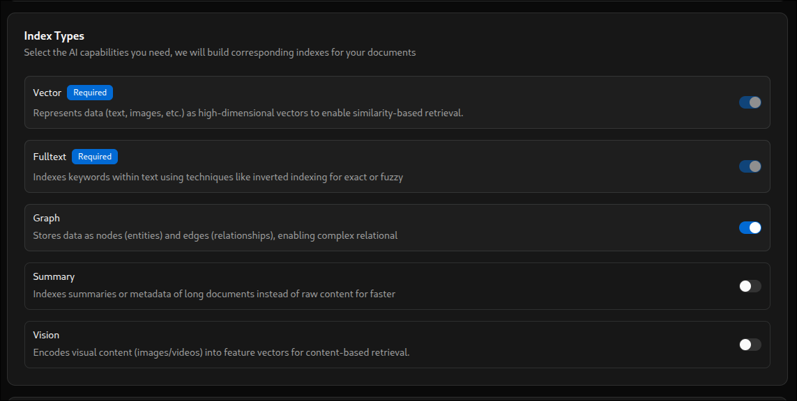

## Zero - ApeRAG 简介

[ApeRAG](https://github.com/apecloud/ApeRAG) 一个号称生产就绪的 GraphRAG 多模态 RAG 引擎。以下是其官网 [https://rag.apecloud.com/](https://rag.apecloud.com/)

目前官方发布了 [ApeRAG v0.5.0-alpha.14](https://github.com/apecloud/ApeRAG/releases/tag/v0.5.0-alpha.14) 版本，其结合了传统向量引擎，全文索引，GraphRAG，视觉索引，摘要索引等多个维度全方面的 RAG 混合检索能力，使用 MinerU 集成作为其增强型的文档处理。在部署方面，官方直接提供了生产级部署的能力：最简可通过 docker 完成基础部署，同时提供了 k8s 部署的实践指导。同时集成了 MCP 服务，提供三方 AI 助手和工具无缝集成访问知识库的能力。

> 当然截止本文截稿，此项目 Github 大概 800+的 star 数目，目前尚处于开发与 alpha 测试阶段，其很多功能并未完善，例如官方独立提供部署的文档解析服务[doc-ray](https://github.com/apecloud/doc-ray)目前并不具备 K8s 下独立部署的能力，以及诸多的 API 功能在后端实现但是现有项目的 Web 端并未提供相关 UI 集成。

## First - 生产部署

### Docker 部署

1. 系统最低配置

- 双核 CPU
- RAM 内存 >= 4 GiB
- 安装有 Docker 以及 Docker compose

1. 使用 Git 工具克隆项目，然后使用 docker compose 命令一键启动。

```shell
git clone https://github.com/apecloud/ApeRAG.git
cd ApeRAG
cp envs/env.template .env
docker-compose up -d --pull always
```

1. 部署完成之后可以在浏览器中访问如下链接

- Web 界面: <http://localhost:3000/web/>
- API 文档：<http://localhost:8000/docs>

1. ApeRAG 默认开启 MCP 集成，启动服务之后使用如下例子配置 MCP 的客户端,提供包括：知识库罗列，混合检索，智能查询等功能。

```json
{
  "mcpServers": {
    "aperag-mcp": {
      "url": "https://localhost:8000/mcp/",
      "headers": {
        "Authorization": "Bearer your-api-key-here"
      }
    }
  }
}
```

### K8s 集群部署

1. 克隆项目仓库以获得部署文件

```shell
git clone https://github.com/apecloud/ApeRAG.git
cd ApeRAG
```

1. 部署数据库服务

ApeRAG 需要 PostgreSQL、Redis、Qdrant 以及 Elasticsearch 等数据库，官方指导中提供了两个选择：

- 使用既有数据库，如果生产环境中已经部署有上述数据库，可以基于`deploy/aperag/values.yaml`文件以配置数据库连接信息，然后直接进行下一步操作。
- 使用 KubeBlocks 部署数据库 - 使用官方提供的自动化数据库部署，数据库连接均为预设：

```shell
cd deploy/databases/

bash ./01-prepare.sh # 安装 KubeBlocks
bash ./02-install-database.sh # 部署 PostgreSQL、Redis、Qdrant、Elasticsearch

kubectl get pods -n default # 检查部署情况

cd ../../
```

等待所有数据库 Pod 处于 `running` 状态后即可进行下一步

1. 部署 ApeRAG 应用本身

```shell
helm install aperag ./deploy/aperag --namespace default --create-namespace # 部署 Ape 服务

kubectl get pods -n default -l app.kubernetes.io/instance=aperag # 检查服务状态
```

1. 配置选项

- 资源要求：默认情况下，包括 [doc-ray 服务(官方提供的可用于独立部署的文档解析服务，但是暂不可用)](https://github.com/apecloud/doc-ray) 需要至少 4 核 CPU，以及 8GB RAM，当然 Doc-ray 可以在 `values.yaml` 中配置`docray.enabled: false`禁用。
- 更多高级设置可以查看`values.yaml`已修改包括图像，资源，和入口的设置

1. 访问部署

在部署完成后即可通过端口转发以访问 ApeRAG

```shell
kubectl port-forward svc/aperag-fronted 3000:3000 -n default
kubectl port-forward svc/aperag-api 8000:8000 -n default
```

## Second - 特性简析

### 文档解析

目前其对于上传的文件大致内置了如下几种文档解析方式

- MarkItDownParser: 依靠微软的 [MarkitDown](https://github.com/microsoft/markitdown) 将文档转换为 Markdown 格式的纯文本文档然后交给其内置实现的 `parse_md` 模块去处理，支持`.txt`、`.md`、`.html`、`.ipynb`、`.pdf`、`.epub` 以及 Microsoft Office 文档（`.docx`、`.doc`、`.xlsx`、`.xls`、`.pptx`、`.ppt`）。
- DocRayParser：是官方提供的另一个独立的微服务[doc-ray](https://github.com/apecloud/doc-ray)，用以提供复杂文档解析`.pdf`、`.docx`、`.doc`、`.pptx`、`.ppt`。，同时支持 GPU 加速功能，需要额外部署并对外提供 HTTP 接口给 ApeRAG 做文档解析。~~但目前其无法运行在 K8s 中~~
- AudioParser：对音频文件 mp3、wav、ogg 文件的支持，通过外部的 Whisper ASR Web 服务将音频转为文本，需要在 ApeRAG 中配置外部服务地址 `settings.WHISPER_HOST`
- ImageParser：从图像中提取文本（OCR 技术），支持`.jpg`、`.png`、`.bmp` 等格式。同样使用了外部服务 PaddleOCR，通过 `settings.PADDLEOCR_HOST` 配置开启
- MinerUParser: 依靠外部 MinerUParser 服务对文档提供高精度的解析服务，需要配置 MinerU API，支持`.pdf`,`.doc`,`.docx`,`.ppt`,`.pptx`,`.png`,`.jpg`,`.jpeg`

> 工作流程

1. 文件上传后暂存在临时目录内，将文件路径传递给总的`DocParser`
1. `DocParser`根据配置选项以及文件类型选择合适的解析器，例如`MarkItDownParser`或者`DocRayParser`
1. 使用选定的解析器处理文件

   - 文件可能会被转换为 Markdown 格式，例如 `MarkItDownParser`
   - 也可能调用外部的服务进行解析，或者使用 OCR/ASR

1. 生成的中间文本交给 `parse_md.py` 解析成为 `Part` 列表（如果适用），此步骤将会将文档结构化为文本单元，例如段落、标题、代码块、并使用对应的解析器处理嵌入的图像
1. 生成的各种类型的 `Part` 对象列表传递给后续的 `chunking.py` 模块中的 `rechunk` 函数
1. `rechunk` 智能组合拆分这些部分，依据传入的 `chunk_size`、`chunk_overlap` 生成符合 token 大小最终文本块，准备好进行嵌入。同时元数据，包括标题层级和源位置将会与每个块关联。
   1. rechunk 首先会将传入的所有 `Part` 分组，按照同层级（类似 H1,H2 这样的分层）或者同级嵌套的合并到统一个组中
   1. 接下来针对上一步生成的 `Groups` 会判断哪些是纯标题组，并将连续的纯标题组合并，并保持层级关系（只合并同级别的标题组，例如同为 H2 的不会合并到 H3 中）
   1. 最后会尝试合并上一步中合并的标题组的 `Part` 们，即将同标题组的内容合并到单一组中返回新合并的组列表
1. 接下来进入正式的 Rechunk 环节
   1. 首先利用栈数据结构处理层级关系，跟踪层级结构
   1. 计算当前处理的组的 Token 数量，与上一组最后一个 `Part` 的层级关系做对比判断是否是父子关系，是的话在满足二者相加小于限制的 `chunk_size` 的情况下将上一组内容合并到当前组中。
   1. 如果当前组无法被合并进上一组中，则直接将上一个 `Part` 直接放入结果列表中
   1. 接着继续处理当前组，遍历当前组所有 `Part`，计算每个 `Part` 的 Token 数量判断是否大于限制的 `chunk_size`,出现大于的情况的话则使用 `SimpleSemanticSplitter` 切分当前 `Part` 成多个不同的 `Part`，并于这些 `Part` 的元数据中标记这些切分出来的 `Part`：`metadata["splitted"] = True`
   1. 针对上一步切分生成的 `Part` 进行一次 Rechunk：
      1. 遍历 `Part` 们计算每个 `Part` 的 Token 数量进行累加，如果小于 `chunk_size` 则合并 `Part`；如果大于 `chunk_size` 限制则将现有 `Part` 存入最终结果。

### 多种索引类型

ApeRAG 针对文档实现了多种类型的索引构建，包括传统向量检索，全文检索，GraphRAG(依托 LightRAG)实现，摘要检索，视觉检索。

其中向量检索和全文检索是必须开启的，即针对一份文档亦或者是知识库而言，这二者是必选的项目，其他三个 Graph、Summary 以及 Vision 都是可选的。



#### 向量索引 (Vector)

ApeRAG 目前使用 [Qdrant](https://github.com/qdrant/qdrant) 作为其向量数据库，使用`collection`（知识库）创建时指定的`embedding model`，同时默认使用 `cl100k_base` 作为其 `tokenizer`.

对于所有的 `Part` 列表，选取其中具有 `content` 文本内容的部分，为这些 `Part` 的元数据添加 `indexer` 字段并附加上 `embedding` 内容。

#### 全文索引 (Full-Text)

全文索引依靠 [Elasticsearch](https://github.com/elastic/elasticsearch) 全文检索引擎实现。

对于所有传入的 `Part` 列表，选取其中具有 `content`的文本内容部分。使用 `rechunk` 函数重新组合生成待处理的 `chunked_parts`, 之后将这些 `chunked_parts` 依次配合代入的元数据交给 `Elasticsearch` 引擎去做索引。

#### Graph 索引 (GraphRAG)

GraphRAG 功能 ApeRAG 依靠 [LightRAG](https://lightrag.github.io/) 实现，并对其做了一系列的优化，包括让其支持生产级的并发处理，分布式任务队列（依靠 Celery/Prefect 实现）和无状态操作。

1. 在其异步创建索引的过程中，首先会检查需要索引的文档以及 `collection` 知识库在数据库中的状态，跳过标记删除的部分
2. 之后读取上传文件的原始位置，并开启计划任务提交给任务队列。
3. 当索引任务进入到执行状态后更新数据库中任务记录的状态。
4. 首先会获取目前项目配置的 GraphRAG 所使用的存储配置，默认是 `PostgreSQL/PGVector`，同时也支持使用 Oracle 数据库、Neo4j 以及 NetworkX。等待存储初始化完成。
5. 接下来使用 LightRAG 构建 LightRAG 实例
6. 对于传入的 `content` 进行异步插入到 LightRAG 实例中待并等待所有处理操作完成。

#### 摘要索引 (Summary Index)

摘要索引所使用数据库与向量索引一致，本质就是使用 LLM 对于传入文档纯文本内容 `content` 和分割好的 `doc_parts` 的内容进行总结，生成 Summary 并附加在元数据中，最后存储在向量数据库中.

Summary 时会根据传入的文本是或否是 chunk 亦或者直接就是完整的文档而选择不同的 prompt。

- Chunk 所使用的 Prompt：

```text
Summarize this text chunk concisely. Requirements:
1. Use the same language as the original text for the summary
2. Keep it within 1-2 sentences
3. Extract only the most important core information
4. Stay objective and accurate, do not add content not present in the original text
5. Output ONLY the summary content, no additional text, explanations, or formatting

Text content:
{text}

Summary:
```

- Document 所使用的 Prompt：

```text
Generate a concise summary of this document. Requirements:
1. Use the same language as the original text for the summary
2. Keep it within 2-3 sentences
3. Summarize the main topic and key insights of the document
4. Stay objective and accurate, do not add content not present in the original text
5. If it's a technical document, highlight the technical points
6. Output ONLY the summary content, no additional text, explanations, or formatting

Document content:
{text}

Summary:
```

1. 首先，对所有包含 `content` 的 `doc_part` 进行 Summary，如果这一步没能满足即没有 doc_part 则直接使用 content 进行 Summary
2. 对于上一步初步 Summary 好生成的 Summary 结果进行 `reduce_summaries`：将上一步初步生成的 Summary 整合在一起之后重新交给 LLM 再做一次总结得到 `final_summary`，以下是总结 `final_summary` 所使用的 prompt:

```text
Combine these section summaries into a comprehensive final document summary. Requirements:
1. Use the same language as the original summaries for the final summary
2. Keep it within 3-4 sentences
3. Integrate the core content from all sections into a coherent overall summary
4. Highlight the main topic and most important insights of the document
5. Maintain logical clarity and avoid repetitive content
6. If technical content is involved, maintain accuracy of technical terminology
7. Output ONLY the final summary content, no additional text, explanations, or formatting

Section summaries:
{combined_summaries}

Final summary:
```

#### 视觉索引 (Vision Index)

视觉索引默认使用用户添加的多模态模型对 `collection` 知识库中的非文本文件进行多模态识别。同时多模态识别具备如下两种方案：

1. 纯粹的视觉方案，将媒体文件直接转换为向量并附加在元数据中存储向量数据库
2. 使用多模态模型的 Vision-to-Text 功能，让大模型去描述媒体文件的内容生成文本，最后将文本向量化存入向量数据库中。以下是其默认使用的提供给大模型做视觉识别的 Prompt:

```text
    Analyze the provided image and extract its content with high fidelity. Follow these instructions precisely and use Markdown for formatting your entire response. Do not include any introductory or conversational text.

1.  **Overall Summary:**
    *   Provide a brief, one-paragraph overview of the image's main subject, setting, and any depicted activities.

2.  **Detailed Text Extraction:**
    *   Extract all text from the image, preserving the original language. Do not translate.
    *   **Crucially, maintain the visual reading order.** For multi-column layouts, process the text column by column (e.g., left column top-to-bottom, then right column top-to-bottom).
    *   **Exclude headers and footers:** Do not extract repetitive content from the top (headers) or bottom (footers) of the page, such as page numbers, book titles, or chapter names.
    *   Replicate the original formatting using Markdown as much as possible (e.g., headings, lists, bold/italic text).
    *   For mathematical formulas or equations, represent them using LaTeX syntax (e.g., `$$...$$` for block equations, `$...$` for inline equations).
    *   For tables, reproduce them accurately using GitHub Flavored Markdown (GFM) table syntax.

3.  **Chart/Graph Analysis:**
    *   If the image contains charts, graphs, or complex tables, identify their type (e.g., bar chart, line graph, pie chart).
    *   Explain the data presented, including axes, labels, and legends.
    *   Summarize the key insights, trends, or comparisons revealed by the data.

4.  **Object and Scene Recognition:**
    *   List all significant objects, entities, and scene elements visible in the image.
```

### 混合检索

ApeRAG 的检索流程其实可以近似理解为将现有集成的五种 RAG 引擎编织成一张有向图工作流，设定起点和终点，从起点开始进发到五种 RAG 进行检索召回，并一起进入到下一个节点做 Merge 合并，在合并完成之后再做一次 Rerank，并将最终结果交给 LLM 节点去做大模型回复。借由如上所述的实现方式，其未来期望规划（从代码中的痕迹来看）还将会支持这张图的自定义。其实现了一个图构建器，你可以使用 yaml 格式的文件去构建自定义的 workflow 工作流。

针对每一种检索方式，都需要有对应的 `Node` 实现，需要规定这个 `Node` 的输入和输出参数，以及节点内部的工作。同时这些输入输出会交给后续的节点作为输入，例如在 merge 的步骤中。

所有的 workflow 中的图节点，在没有依赖关系的情况下会被并行执行以优化效率，例如所有的 Search 节点。而当节点之间存在依赖关系时则会进行顺序执行的逻辑，例如 Merge 和 Rerank 两个节点二者是相互依赖的关系因此会顺序执行。

> PS: 以下所有的 `collection_ids` 虽然都是列表，理论上是复数个 collection 知识库的 id，但是实际项目中获取知识库详情时都是使用 `collection_ids[0]` 也就是这个列表其实只会使用第一个 id。

#### Vector Search 向量检索

- 输入结构

```python
class VectorSearchInput(BaseModel):
    top_k: int = Field(5, description="Number of top results to return")
    similarity_threshold: float = Field(0.2, description="Similarity threshold for vector search")
    collection_ids: Optional[List[str]] = Field(default_factory=list, description="Collection IDs")
    chat_id: Optional[str] = Field(None, description="Chat ID to filter chat documents")
```

- 输出结构

```python
class VectorSearchOutput(BaseModel):
    docs: List[DocumentWithScore]
```

- 工作流程

  1. 首先根据传入的 `collection_ids` 从常规数据库中拉取数据集详情信息，并依据这些详情信息构建向量数据库实例，同时初始化对应的 embedding 模型。
  2. 使用 embedding 模型将用户输入转换为 vector 向量，并使用向量数据库实例去查询召回 `topK` 个结果。
  3. 对结果做一下遍历，标记这些结果的召回来源，即标记 `metadata.recall_type = "vector_search"`

#### Fulltext Search 全文检索

- 输入结构

```python
class FulltextSearchInput(BaseModel):
    query: str = Field(..., description="User's question or query")
    top_k: int = Field(5, description="Number of top results to return")
    collection_ids: Optional[List[str]] = Field(default_factory=list, description="Collection IDs")
    keywords: Optional[List[str]] = Field(
        default_factory=list, description="Custom keywords to use for fulltext search"
    )
    chat_id: Optional[str] = Field(None, description="Chat ID to filter chat documents")
```

- 输出结构

```python
class FulltextSearchOutput(BaseModel):
    docs: List[DocumentWithScore]
```

- 工作流程

  1. 根据 `collection_ids` 从常规数据库中获取知识库详情信息
  2. 使用 `settings.llm_keyword_extraction_provider` 等配置去使用大模型提取查询内容关键词，当然默认配置缺省使用 `IKKeywordExtractor`。
  3. 使用关键词去 elasticsearch 数据库进行全文检索，根据召回的结果内附带的 `_source` 参数去获取原始的 chunk 段落返回
  4. 给所有返回结果附加上召回类型 `metadata.recall_type = "fulltext_search"`

#### Summary Search 摘要检索

- 输入结构

```python
class SummarySearchInput(BaseModel):
    top_k: int = Field(5, description="Number of top results to return")
    similarity_threshold: float = Field(0.2, description="Similarity threshold for summary search")
    collection_ids: Optional[List[str]] = Field(default_factory=list, description="Collection IDs")
```

- 输出结构

```python
class SummarySearchOutput(BaseModel):
    docs: List[DocumentWithScore]
```

- 工作流程

  因为摘要检索本质其实还是一种向量检索，只是检索的内容是通过 LLM 大模型根据原文 Chunk 生成的摘要，因此这里的检索步骤其实和之前的向量检索大同小异

  1. 根据 `collection_ids` 从传统数据库召回知识库详情信息。
  2. 依靠 collection 信息初始化好 embedding model 和向量数据库句柄。
  3. 将传入的查询文本使用对应的 embedding model 转换为查询向量。
  4. 使用句柄进行向量检索并对所有返回结果附加上召回类别 `metadata.recall_type = "summary_search"`

#### GraphRAG 检索

- 输入结构

```python
class GraphSearchInput(BaseModel):
    top_k: int = Field(5, description="Number of top results to return")
    collection_ids: Optional[list[str]] = Field(default_factory=list, description="Collection IDs")
```

- 输出结构

```python
class GraphSearchOutput(BaseModel):
    docs: List[DocumentWithScore]
```

- 工作流程

  1. 根据 `collection_ids` 从传统数据库获取知识库详情
  2. 对该知识库是否开启图检索做一次校验，如果没有开启则直接返回空列表
  3. 根据知识库 `collection` 的详情配置初始化 `LightRAG` 实例，这里的实例实际上启动的是一个 ApeRAG 二次封装过的 LightRAG 实例，这个实例的改进了 LightRAG 的检索使之支持并行，同时优化了 LightRAG 的存储使之可以支持 PG 等数据库。
  4. 使用 LightRAG 的 hybrid 进行混合检索召回 `topK` 个结果
  5. 将返回结果附加上召回类别 `metadata.recall_type = "graph_search"`

#### Vision Search 视觉检索

- 输入结构

```python
class VisionSearchInput(BaseModel):
    top_k: int = Field(5, description="Number of top results to return")
    similarity_threshold: float = Field(0.2, description="Similarity threshold for vision search")
    collection_ids: Optional[List[str]] = Field(default_factory=list, description="Collection IDs")
```

- 输出结构

```python
class VisionSearchOutput(BaseModel):
    docs: List[DocumentWithScore]
```

- 工作流程

  1. 根据 `collection_ids` 获取传统数据库存储的知识库详情
  2. 依据知识库配置初始化向量数据库句柄以及 embedding model
  3. 针对用户输入使用对应的 embedding model 向量化处理
  4. 将输入内容在向量数据库中做查询。到这里会发现其实这一步和向量检索几乎没有区别，所以作者为了防止这一步和向量检索重复，因此这里作者召回数量其实是 2 \* topK 两倍的 topK 以确保召回了之前存储的视觉相关内容
  5. 对返回结果附加上召回类型 `metadata.recall_type = "vision_search"`

#### Merge 节点

- 输入结构

```python
class MergeInput(BaseModel):
    merge_strategy: str = Field("union", description="How to merge results")
    deduplicate: bool = Field(True, description="Whether to deduplicate merged results")
    vector_search_docs: Optional[List[DocumentWithScore]] = Field(
        default_factory=list, description="Vector search docs"
    )
    fulltext_search_docs: Optional[List[DocumentWithScore]] = Field(
        default_factory=list, description="Fulltext search docs"
    )
    graph_search_docs: Optional[List[DocumentWithScore]] = Field(default_factory=list, description="Graph search docs")
    summary_search_docs: Optional[List[DocumentWithScore]] = Field(
        default_factory=list, description="Summary search docs"
    )
    vision_search_docs: Optional[List[DocumentWithScore]] = Field(
        default_factory=list, description="Vision search docs"
    )
    qa_search_docs: Optional[List[DocumentWithScore]] = Field(default_factory=list, description="Q&A search docs")
```

- 输出结构

```python
class MergeOutput(BaseModel):
    docs: List[DocumentWithScore]
```

- 工作流程

  - merge 并没有什么复杂的流程，目前只做了一个简单的使用 python 的 Set 集合结构依据召回内容的 text 文本对所有召回文档进行去重。

#### Rerank 节点

- 输入结构

```python
class RerankInput(BaseModel):
    use_rerank_service: bool = Field(default=True, description="Whether to use rerank service or fallback strategy")
    model: Optional[str] = Field(default=None, description="Rerank model name")
    model_service_provider: Optional[str] = Field(default=None, description="Model service provider")
    custom_llm_provider: Optional[str] = Field(
        default=None, description="Custom LLM provider (e.g., 'jina_ai', 'openai')"
    )
    docs: List[DocumentWithScore]
```

- 输出结构

```python
class RerankOutput(BaseModel):
    docs: List[DocumentWithScore]
```

- 工作流程

  1. 根据传入参数 `use_rerank_service` 决定是否使用三方的 rerank 服务（例如 openai 以及其他大模型供应商提供的 rerank 服务接口），如果不使用则使用默认逻辑：GraphRAG 结果放在前面，剩余的各种向量检索结果按照 Score 得分从高到低排列。
  2. 如果 rerank 配置的参数不合法则也会使用默认策略
  3. 根据配置的 rerank 服务执行 rerank
