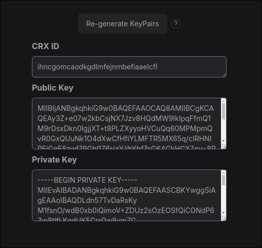
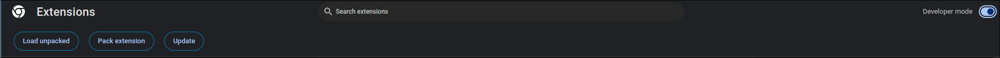
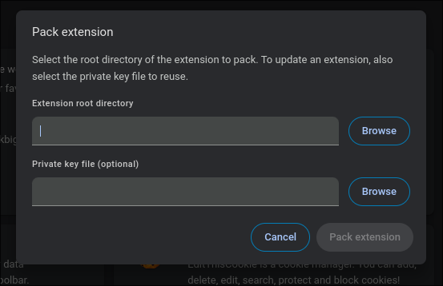
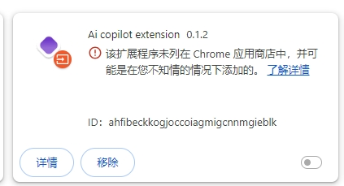
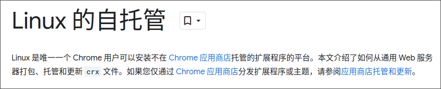

## Start

公司项目使用开发了一款公司内部使用的Chrome浏览器插件. 在没有上架Chrome应用程序商店的情况下,产品希望集成实现插件自升级, 而不需要每次手动安装包.

毕竟上架公共的应用程序商店Google对于插件的权限管控审核,服务条款有着较为严苛的要求, 同时还有~~巨额~~的5$ Chrome插件开发者注册费用. 最主要的是项目不希望每次发版受限于谷歌审核导致延迟. 因此研究了一下在不上架谷歌应用商店的情况下实现插件自升级.

## Zero

### 1. 生成发布用公私钥对

- 可以使用Plasmo提供的插件密钥生成工具CRX Keys [Generator - Plasmo Itero](https://itero.plasmo.com/tools/generate-keypairs)



- CRX ID: 使用该公私钥打包生成的插件ID
- Public Key: 公钥, 可以填写在Plasmo项目的.env文件中添加CRX_KEY, 用来Plasmo确保构建生成的插件ID与上面生成的CRX ID一致
- Private Key: 私钥, 需要保存为key.pem文件, 供给Chrome浏览器打包使用, 确保Chrome打包程序生成的CRX插件ID与上述ID一致.


### 2. 添加update_url字段

  该字段为一个文件服务器上updates.xml文件地址(当然updates.xml文件可以自定义)

```
{
  "version": "0.1.1",
  "author": "wiz.ai",
  "name": "Ai copilot extension",
  "description": "An extension for AI copilot",
  ...
  "update_url": "http://update.server.com/updates.xml"

}
```

如果是Plasmo项目, 可以在项目根目录中的package.json文件的manifest字段中添加. 这样Plasmo构建生成的插件将会自动将manifest字段中的参数嵌入到生成的插件文件manifest.json中
```
{
  "name": "ai-copilot-extension",
  "displayName": "Ai copilot extension",
  "version": "0.1.1",
  "description": "An extension for AI copilot",
  "author": "wiz.ai",
  ...
  "manifest": {
      ...
      "update_url": "http://update.server.com/updates.xml"
  }
}
```

### 3. updates.xml文件内容

```
<?xml version='1.0' encoding='UTF-8'?>
<gupdate xmlns='http://www.google.com/update2/response' protocol='2.0'>
  <app appid='ahfibeckkogjoccoiagmigcnnmgieblk'>
    <updatecheck codebase='http://update.server.com/v0.1.0/chrome-mv3-prod.crx' version='0.1.0' />
  </app>
</gupdate>
```
  需要注意修改的参数
  - Appid: 插件的ID, 使用步骤1生成的CRX ID
  - Codebase: 新版本插件下载用url
  - Version: 新插件的版本
  Appid 是Chrome浏览器用以鉴别区分插件的唯一参数, 需确保插件构建生成的ID与updates.xml中的appid, 以及codebase url下载下来文件的插件ID三者一致, 才可以正常更新

### 4. 构建CRX版本插件

  1. 首先使用Plasmo构建出标准插件,(使用原生Chrome v3编写的插件可以跳过这一步)

```
plasmo build
```

  2. 使用chrome浏览器对生成的插件构建文件进行重打包,生成CRX文件
      - 打开chrome进入插件管理页面, 点击页面右上角启用开发者模式
      
      - 点击左侧第二个按钮"打包插件(Pack extension)"
      
      - 在弹出的界面中第一行Extension root diretory选择上一步中Plasmo生成插件文件夹
      - 在第二行页面中的Private key file选择第一步公私钥生成的key.pem私钥文件
      - 点击Pack extension最终生成打包好的插件crx文件, 文件会位于插件文件夹同级目录

  3. 也可以使用命令行构建crx文件

```
chrome.exe --pack-extension=C:\myext --pack-extension-key=C:\myext.pem
```

### 5. 发布到升级用的服务器

将上面几步中构建生成的CRX插件文件,以及updates.xml上传到准备好的用于自升级的服务器中

  - updates.xml: http://update.server.com/updates.xml
  - crx文件: http://update.server.com/0.1.0/chrome-mv3-prod.crx
  确保updates.xml中的appid以及codebase正确. 即完成发版.

### 6. Windows平台

**到这上一步在linux平台上使用chrome浏览器中的该插件就已经可以实现依托于chrome自己的插件版本升级服务进行升级. 但是对于windows平台较新版本chrome使用该插件的用户,会出现直接安装crx格式文件的插件, 插件无法启用, 且自升级无效的问题.**



原因是Google对于Chrome插件加载的限制.



在windows中如果想要使用非chrome应用商店托管的扩展程序, 需要采用Chrome企业版策略来实现加载非Chrome应用商店的扩展程序. 但是也是有一些黑科技方案可以绕过这一限制. 即修改windows注册表强制chrome允许特定ID的插件

- 使用如下注册表命令, 复制文本保存为.reg文件在windows下运行即可. 注意替换"lkbebcjgcmobigpeffafkodonchffocl"为正确的chrome 插件ID
```
Windows Registry Editor Version 5.00

[HKEY_LOCAL_MACHINE\SOFTWARE\Policies\Google\Chrome\ExtensionInstallAllowlist]
    "1"="lkbebcjgcmobigpeffafkodonchffocl"
```

当注册表成功修改之后, 重启安装了crx文件的chrome浏览器即可发现插件可以正常启用.当然chrome浏览器本身会多一些提示文字.

- 想要恢复注册表可以使用如下的代码保存为.reg文件运行
```
Windows Registry Editor Version 5.00

[-HKEY_LOCAL_MACHINE\SOFTWARE\Policies\Google\Chrome\ExtensionInstallAllowlist]
```