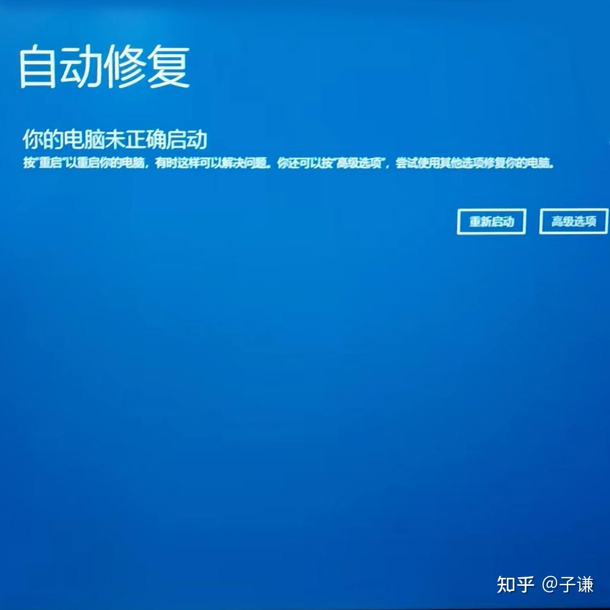
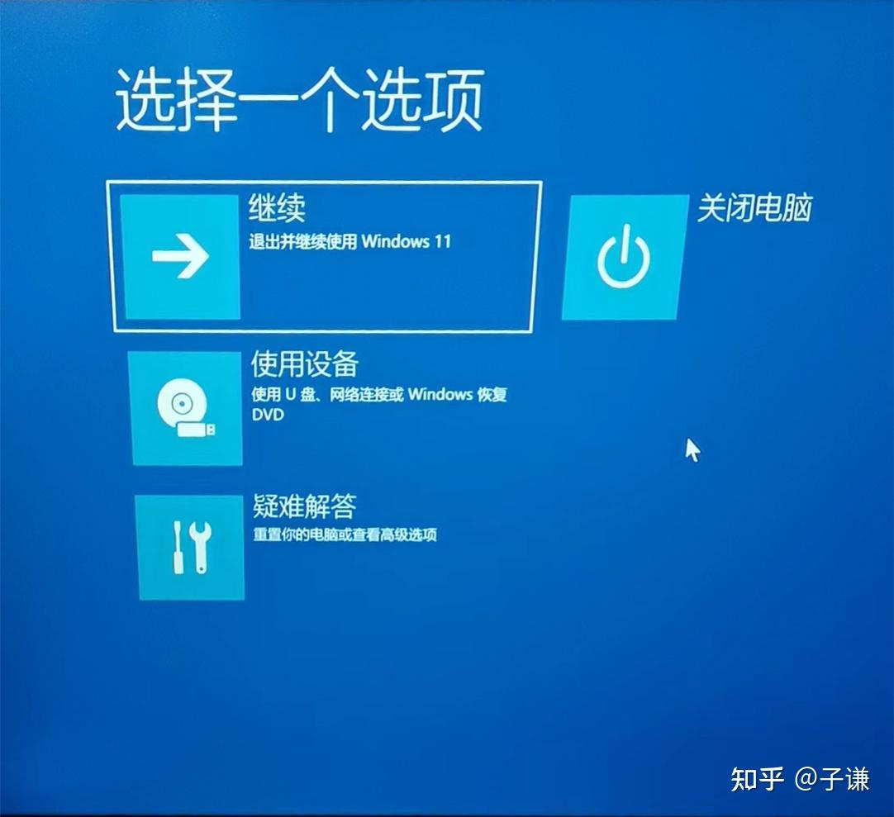
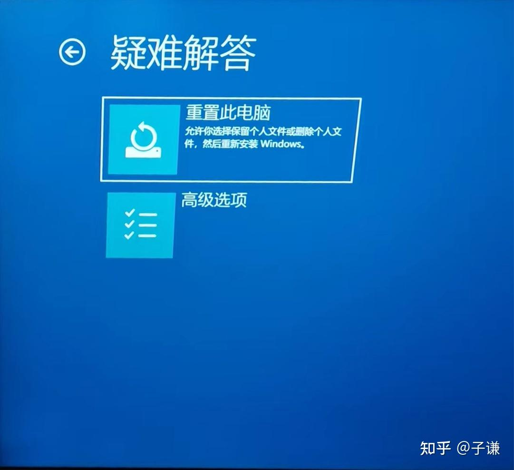
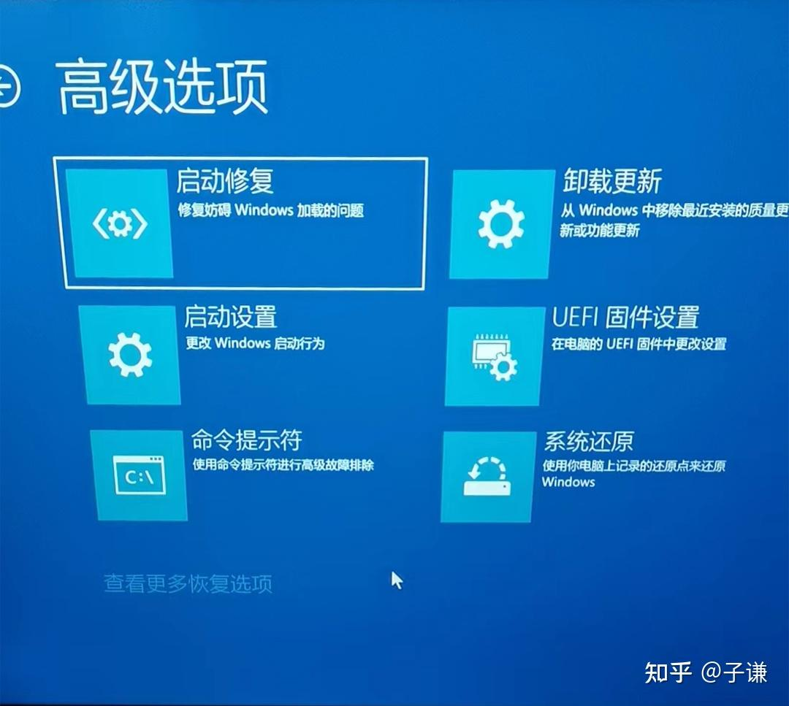
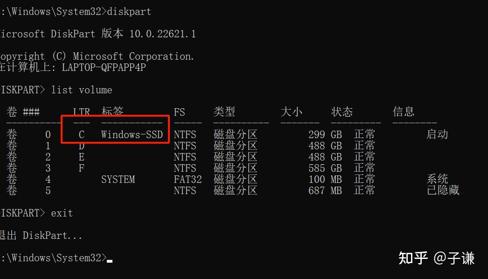
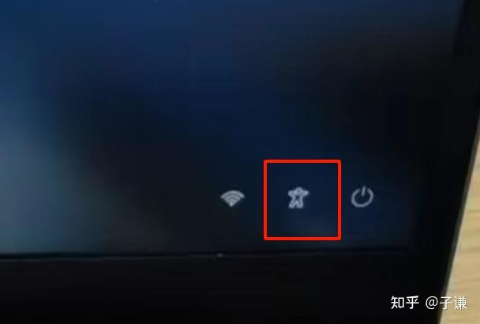
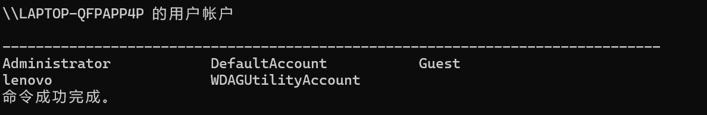

## Zero

最近偶然帮公司重置前离职员工留下的电脑，发现了一种无需重置系统即可重置本地账户密码的方：

- [参考文章](https://zhuanlan.zhihu.com/p/685629242)

**重要声明：这个方法仅适用于本地账户，且是磁盘未开启 BitLock 加密的情况。**

这个方法通过替换 Win11 登录页面上的辅助工具为 cmd 命令行，从而使得可以在登录页面启动带有系统管理员权限的命令行进而达到重置本地账户密码的操作。

## First

1. 首先我们需要想办法进入 Windows 恢复页面

   进入方法也很简单，在登录页面按住 shift 按钮点击右下角的电源键选项中的重新启动按钮，这样系统在重启之后就会自动进入 WinRE 恢复页面。

   当然也可以通过强制触发两次系统故障的方式让系统强制启动失败然后进而进入 WinRE 界面。两次启动失败后 Windows 会进入自动修复模式，在等待其自动修复未果之后会进入到如下页面。这时候点击`高级选项`即可进入步骤 2 的界面。（当然如果你是直接通过重启进入的会直接抵达步骤 2）
   

1. 进入到恢复页面选项后点击`疑难解答` -> `高级选项`

   
   
   当然在进入高级选项之前已经可以看到`重置此电脑`的选项了，在这里如果这时候不在乎重置之后导致的数据丢失可以直接考虑不保留用户信息进行重置。

1. 进入到疑难解答的高级选项之后，点击`命令提示符`，使用命令提示符进行高级排障。
   

1. 在命令提示符内输入如下命令以获取目前电脑上的所有盘符并确定 windows 系统盘位置

   ```shell
   dispart
   list volume
   ```

   理论上可以看到当前系统上盘符的情况类似如下图。其中使用 `Windows-SSD` 一类标记的就是 C 盘。但是笔者在这里实践的情况下遇到了不一样的情况，并没有任何一个盘符标记了 `Windows-SSD` 并且其实这里的盘符 C 盘也不是真正的系统盘，真正的系统板是 D 盘的情况。其实这里更推荐 `exit` 退出 diskpart，并命令行中使用 `dir` 命令罗列各个刚刚出现的各个盘符查看其目录结构，找到包含 windows 目录的盘符，这个就是真正的系统盘所在盘符。
   

1. 假定刚刚找到的系统盘盘符为 C， 使用 `exit` 退出 diskpart。输入如下命令备份 `Utilman.exe` 到 C 盘根目录。

   ```powershell
   copy C:\Windows\System32\Utilman.exe C:\
   ```

1. 接下来将 `C:\Windows\System32\Utilman.exe` 程序覆盖为 `cmd.exe`

   ```powershell
   del C:\Windows\Systme32\Utilman.exe
   copy C:\Windows\System32\cmd.exe C:\Windows\System32\Utilman.exe
   start C:\windows\system32\Utilman.exe
   ```

1. 执行完刚刚的覆盖操作后在命令行输入 `wpeutil reboot` 命令重启电脑。

1. 再次会到登录页面的时，右下角“小人”图案代表的辅助系统其实已经变成了 `cmd.exe` 的入口，只要点击小人就会启动 cmd 命令行。

   

1. 接下来开始真正的密码重置部分，在点击小人开启的命令行中输入如下命令：

   1. 输入 `net user` 查看当前系统中所有的用户名称
      
   1. 找到你忘记密码的本地用户账户名，假设是 “lenovo” ，使用如下命令将 lenovo 用户密码重置为 123456。

   ```powershell
   net user lenovo 123456
   ```

   1. 到这里位置你已经可以使用 123456 作为这个被遗忘的本地账户的密码登录到该电脑中了。

1. 最后一部还原 `Utilman.exe` 到本身目录。

   打开具有管理员权限的命令行，输入以下指令将之前被替换为 cmd.exe 的 Utilman.exe 文件还原为备份的真正的 Utilman.exe

   ```powershell
   del C:\Windows\System32\Utilman.exe
   copy C:\Utilman.exe C:\Windows\System32\Utilman.exe
   start C:\Windows\System32\Utilman.exe
   ```

   当第三条 start 命令回车之后点自动弹出 Windows 的设置页面即说明还原成功，这时候即可删除 C 盘根目录下备份的 `Utilman.exe` 文件。当然个人感觉这里完全可是使用任务管理器操作，直接复制粘贴即可。

1. PS **如果重置密码前你是用的是 Pin 码登录，在重置密码成功之后需要将登录验证方式切换为密码验证，然后使用重置后的密码登录才可以哦。**
