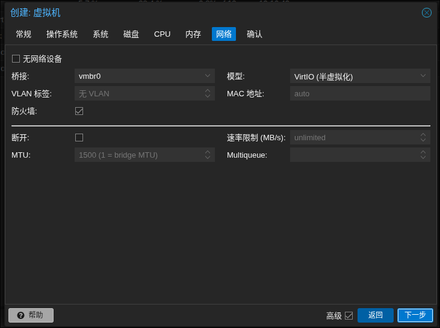
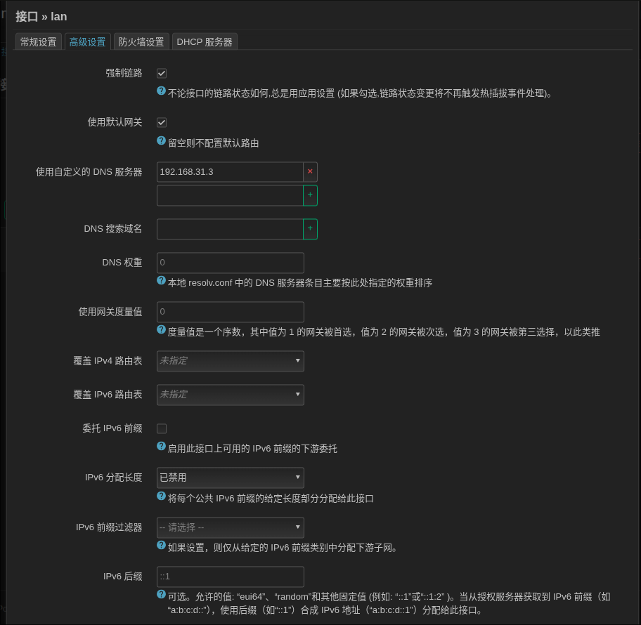

## Start

家里的软路由设备在一起重启之后炸了。

~~原因大概是因为之前使用一些黑科技魔法将 PVE 安装在了 TF 卡里启动，结果就是导致 PVE 的引导其实并没有完备，重启后引导丢失就 All In One 变成 All In Boom 了，这段划掉~~

所以说以后服务安装完成设备测试的时候最基础的重启测试要保证，嗯！

所以这是一篇写于 2025-05-13 的有关在 Proxmox VE 虚拟环境中使用虚拟机安装 openwrt 并配置为旁路由附加“魔法科技”，广告过滤（AdguardHome）与本地 DNS（smart dns）的文章。所有用到的软件版本大致如下：

- openwrt: [Immortalwrt 的最新稳定版 ImmortalWrt 24.10.1](https://github.com/immortalwrt/immortalwrt)
- Proxmox VE： [Proxmox VE 8.4](https://www.proxmox.com/en/downloads)

这里不推荐任何其他版本的 Openwrt 分支， 尤其是很多号称高大全的版本。 如果你只是需要一个开箱即用的软路由，只寻求最基本的魔法能力，不在乎 DNS 劫持问题，DNS 泄露问题，不在乎广告过滤那么很可能“高大全”的 openwrt 是一个非常好的选择。但是如果你的需求一旦个性化一点，这些高大全的版本在经历任何过多的配置后都会出现各种稀奇古怪的问题。

当然推荐 ImmortalWrt 的主要原因是其拥有活跃的社区，硬件支持广泛，以及提供“中国特色工具”的同时保证了本身的精简性。本文内任何没有明说 openwrt 分支的情况下均默认为 ImmortalWrt。

> 题外话：
> ~~可恶，怎么喜欢折腾软路由啊，这么中年油腻大叔的爱好，泪目~~

有关 PVE 环境的安装这里就不多赘述了，因为本身比较简单，~~不要学习我之前搞骚操作在 TF 卡里安装 PVE 的话~~直接在 U 盘 中刷写好 PVE 的安装镜像，引导进入安装程序后按照提示步骤来即可，google 有很多文章讲这个。

## Openwrt 镜像选择

首先从 [ImmortalWrt 官方下载网站](https://downloads.immortalwrt.org/) 根据硬件情况选择合适的镜像。由于这里使用的是 PVE 支持的虚拟机做软路由，因此仅需要使用默认的 x86/64 版本即可。


在 [https://downloads.immortalwrt.org/releases/24.10.1/targets/x86/64/](https://downloads.immortalwrt.org/releases/24.10.1/targets/x86/64/) 这个目录下可以看到如图所示的各种不同文件系统的镜像，这里简单讲述一下差别：

镜像可以按照文件系统分为两个大类：

- squashFS： 一种只读压缩文件系统，空间占用小。同时只读的特性，运行时可写的配置文件挂载在其他存储中，具备一键还原的功能。但是扩容非常麻烦，如果你需要安装非常多的插件以及配置需要额外的系统运行空间，这个镜像不推荐。如果你只是轻度的配置，同时设备本身存储空间有限可以考虑这个版本。
- ext4: 广泛使用的 Linux 文件系统，相较于 squashFS 而言大概唯一的缺陷是不具备重置配置的功能，以及占用空间更大。优点就是方便扩容，扩展性更好。

再细分下去的区别就是有无 EFI（引导方式区别）以及镜像文件格式区别。

- img：原始磁盘影响文件，直接表示磁盘字节内容，适用范围更广的默认格式。
- qcow2：是 QMEU 虚拟机所使用的磁盘映像格式，适用于 QEMU 以及 KVM 也就是 PVE 默认支持的格式。支持压缩加密以及 PVE 的动态扩容。
- vdi： 是 VirtualBox 的磁盘映像格式。
- vhdx: 是 windows 下 Hyper-V 的磁盘格式。
- vmdk： 是 VMware 虚拟机所使用的硬盘格式。

这里为了后面方便磁盘扩容以及配置，我们选择 ext4 版本附带 efi 支持的 qcow2 镜像 [generic-ext4-combined-efi.qcow2.gz](https://downloads.immortalwrt.org/releases/24.10.1/targets/x86/64/immortalwrt-24.10.1-x86-64-generic-ext4-combined-efi.qcow2.gz)

使用任何你常用的工具将其下载到 PVE 机器上。可以是 wget 也可以是下载到本地后上传。 这里无法使用 PVE 自己 iso 管理时用的“从 URL 下载”功能，因为其文件格式不支持无法被识别。

## Openwrt 虚拟机创建

1. 进入 Proxmox 管理后台，选择右上角的 `创建虚拟机` 按钮。
   

1. 在“常规”创建虚拟机配置页面上设定好虚拟机名称，**同时请记下这个 VM ID： 103，后面会用到**。名称设置完成勾选开机自启，启动顺序按照需求设定 0 第一个。之后点击下一步。（如果你看不到启动顺序和开机自启动选项的话请勾选右下角返回旁边的“高级”选项）
   

1. 在“操作系统” Tab 中选择不需要任何介质，因为刚刚下载的镜像将被作为磁盘导入，而不是启动镜像。
   

1. 在“系统”页面全部保持默认即可。
   

1. 在“磁盘”页面也是保持默认即可，因为后面我们会删掉这个磁盘，因此不需要任何配置
   

1. 在 “CPU” 页面设定一下核心数目，因为我的需求只是单纯的软路由因此不需要太多的性能，两个核心即可。
   

1. 在“内存”页面设定内存大小，同上一般 1GB 内存即可。
   

1. 在“网络”页面全部使用默认配置即可
   

1. 在“确认”页面确认一下之前的设定，**不要勾选左下角的创建后启动**，创建完成之后还有其他的工作要做。
   

## Openwrt 虚拟机配置

1. 在虚拟机创建完成之后，点击刚刚创建还未启动的虚拟机，选择“硬件” -> 选中虚拟机的硬盘 -> 点击上方的“分离”。
   

1. 分离完成之后会出现一个“未使用的磁盘 0”，再点击上面的“移除”，删除掉默认磁盘。
   

1. 移除完成之后，去到 Proxmox 的 Shell 控制台，找到刚刚下载的 Openwrt 镜像文件， 再使用 gunzip 或者 gzip -d 解压下载文件

```shell
gunzip immortalwrt-24.10.1-x86-64-generic-ext4-combined-efi.qcow2.gz
// or
gzip -d immortalwrt-24.10.1-x86-64-generic-ext4-combined-efi.qcow2.gz
```

接下来使用如下命令导入解压后的磁盘印象文件给刚刚创建的虚拟机，这里要使用到刚刚记下的虚拟机编号 102。 local-lvm 是默认的虚拟机磁盘存储名，可能会因为机器不同而需要更改

```shell
qm importdisk 102 immortalwrt-24.10.1-x86-64-generic-ext4-combined-efi.qcow2 local-lvm
```

1. 导入完成后会到虚拟机配置，选择“硬件”可以看到又多了个“未使用的磁盘 0”，双击 ta 添加这个磁盘到虚拟机中。参数选项保持默认即可。
   

1. 磁盘添加完成之后，点击左侧“选项”页，将其添加到“引导顺序”中设置为第一位。
   

1. 最后即可启动 openwrt 虚拟机，然后开启愉快~~饱受折磨~~的软路由配置旅程。

## 网络拓扑

在开始具体的配置前，先明确讲一下本次的网络拓扑结构。


- 首先辛苦装宽带的师傅将光猫改成桥接。将拨号上网交给成品路由负责，避免光猫羸弱的性能影响网速，同时以便于开启成品路由本身的 IPv6 Native 原生模式以便内网服务器可以下发到 IPv6 地址。当然这一步是可选的，主路由与光猫之间如何连接对于软路由来说其实并不关心。

- 接下来假设主路由的 IP 地址是“192.168.31.1”，软路由 Openwrt 则配置为旁路由模式 IP 地址“192.168.31.3”。旁路由配置方法这里不赘述，如果不理解旁路由看到这里意味着你需要去补课旁路由知识点了。

> ~~别问我“192.168.31.2”在哪里，那是 PVE 的静态地址~~

- 由主路由负责局域网的 DHCP 服务，并将 DHCP 下发的给客户端的 DNS 服务器和网管配置为旁路由地址： 192.168.31.3。因为考虑如果 DHCP 位于软路由上，一但软路由 GG 了局域网 DHCP 服务也就没了。

> 但是也有人会说：“即使 DHCP 位于主路由，在旁路由模式下下发给客户端的 DNS， 网关都是旁路由，客户端不也是无法上网。”
> 但是其实这里好办，真的出现状况了只需要客户端强制指定网络 DNS 和网管到主路由即可恢复临时通讯，亦或者是修改主路由上的 DHCP 服务下发的 DNS 和网关回默认即可临时恢复网络 ~~别问我自己为什么不选择后者，因为 TMD 小米路由器修改个 DHCP 都要重启。~~

- 同时 DHCP 配置分配范围从 192.168.31.64 到 192.168.31.254。因为前 1-63 位考虑到全部交给静态分配。这一步可缺省。

- 在旁路由上安装 Passwall2 + Smart DNS + Adguard Home。

- 假设这三个服务全部配置完成，那么理想情况下的 DNS 请求顺序就是如下：
  - 首先客户端发起 DNS 请求到旁路由。
  - Passwall2 开启 DNS 劫持将所有的 DNS 交给 Passwall2 依据域名做分流，境内域名发送给 AdGuard Home， 境外路由则转发给专门负责境外部分的 AdGuard Home 处理（其实也可忽略境外用的 AdGuard Home，因为软路由本身只支持管理一个 AdGuard Home 实例，要同时实现两个则需要依靠 Docker 运行双服务，所以境外的是可以缺省的，如果缺省就直接发给 Smart DNS 的第二 DNS 服务。）
  - 发送到境内 AdGuardHome 的 DNS 请求会请求上游 SmartDNS 的默认 DNS 服务，专门配置有境内的 DNS 上游服务器。ADGuardHome 对请求结果过滤广告 DNS 并返回。
  - 发送到境外 AdGuardHome 的 DNS 请求会转发给上游 SmartDNS 的第二 DNS 服务，专门配置有境外 DNS 上游服务器，并通过配置代理，借由 Passwall2 的 Socks5 代理请求上游服务器，最后再由 AdGuardHome 负责过滤的部分。

至此，一套境内外全广告过滤的网络拓扑即搭建完成。

## Openwrt 配置

### 基础配置

1. 书接上回，在 PVE 中启动刚刚创建的 Openwrt 虚拟机。首先编辑`/etc/config/network`设定好软路由的静态地址。静态地址配置完成后即可通过 Web 访问 Openwrt 后台。 ImmortalWrt 默认是不具备 root 密码的，可以通过 `passwd` 命令或者在 Web 页面后续修改登录密码。

   ```plaintext
   config interface 'lan'
           option device 'br-lan'
           option proto 'static'
           option ipaddr '192.168.31.3'
           option netmask '255.255.255.0'
           option ip6assign '60'
   ```

1. 登录 Openwrt Web 界面后，选择`网络`下的`接口`，继续编辑默认的`lan`接口，同时可以删除其他原始的默认接口，旁路由模式下仅仅有一个`lan`接口即可。刚刚仅仅设置了静态地址，还需要配置好接口的网关和默认 DNS。
   

1. 配置 IPv4 网关为主路由地址：192.168.31.1，子网掩码：255.255.255.0。IPv6 部分留空即可。
   

   > 这里也不准配置 IPv6 部分，v6 下的旁路由开启后出现了网页静态资源加载变慢的问题。以及由于是桥接路由器拨号，所以客户端设备经常会收到运营商下发的 IPv6 DNS，导致魔法破功，无法从软路由侧屏蔽这个运营商下发的 v6 DNS 同时 windows11 电脑又会默认优先 v6 总之导致了很多加载变慢乃至打不开网页的问题，总之别轻易碰国内的 v6 会变得不幸。
   > 同时刚刚上面主路由配置的 v6 模式是 Native 原生，所以哪怕旁路由不配置 v6 相关的东西其他客户端依然可以分配到主路由下发的 v6 地址，一定程度上并不影响就其他设备的 v6.

1. `高级设置`下设定`使用自定义的DNS服务器`为 114.114.114.114，先让旁路由成功联网，后面会改成旁路由本身。
   

1. `DHCP 服务器`下勾选`忽略此接口`，不在此接口提供 DHCP 服务。IPv6 相关设置全部禁用
   
   
   

1. 保存并应用后可以测试一下网络，理论上这时候软路由已经有了网络。因此可以切换到`系统`->`软件包`，点击`更新列表`更新软件包源，先把需要更新的包全部更新一遍，确保系统软件包最新后开始安装我们所需要的服务。

1. 转到`网络` -> `防火墙`，删除除`lan`以外的防火墙配置，仅保留`lan`即可。

   1. 勾选`启用 FullCone NAT`
   2. 勾选`启用 SYN-flood 防御`
   3. `入站数据`，`出站数据`，`转发`全部调整为接受，这是旁路由模式下必备的设置
      

1. 点开防火墙内的默认`lan`的编辑
   
   1. 开启 `IP 动态伪装`，这是 IPv4 下 NAT 模式必须的。
   2. 开启 `MSS 钳制`，以确保大数据包路由转发正常，如果这个不开启会导致类似：网页访问基本正常，但是类似 wegame 这样的程序登录无法成功。
   3. 确保一下编辑详情内`涵盖网络`包含设备对应硬件网口设备。

### 插件安装

1. 首先是安装 smartDNS，在`过滤器`中搜索 luci-app-smartdns，点击安装，同时安装对应的翻译包

1. AdGuard Home 在 ImmortalWrt 自带的源中并不具备 luci 管理界面，因此这里就就有两个选择。

   1. 如果你准备安装一个 AdGuard 实例用于过滤国内 DNS，那么可以去[https://github.com/rufengsuixing/luci-app-adguardhome](https://github.com/rufengsuixing/luci-app-adguardhome) 这个连接下下载 luci。
   2. 如果也准备使用两个实例分别处理国内国外的 DNS 请求， 那么可以在这里在 Openwrt 上安装 docker 服务，然后使用 docker 托管两个 AdGuard Home 容器。同时如果你准备安装 docker， 那么原始默认的镜像磁盘大小可能是捉襟见肘的，因此需要扩容操作。

1. Passwall2 在 ImmortalWrt 的自带源也不存在（但是 ImmortalWrt 源里具有 Passwall 一代），所以需要去 [https://github.com/xiaorouji/openwrt-passwall2](https://github.com/xiaorouji/openwrt-passwall2) 下载最新版本的 luci 自行上传安装。记得同时安装 Passwall2 的翻译包。

### 根目录扩容

1. 首先确保如下软件的安装`parted，losetup，resize2fs`软件的安装。没有的话使用 luci 界面搜索安装或者使用如下 shell。

   ```shell
   opkg update
   opkg instal parted losetup resize2fs
   ```

1. 网上有关扩容的文章五花八门，其实如果简单点，Openwrt 官方提供了一键脚本用于根目录扩容，同时支持 ext4，squashfs 两种镜像文件系统。

   ```shell
   sh /etc/uci-defaults/70-rootpt-resize
   ```

1. 部分魔改的 Openwrt 分支可能没有这个脚本，如果设备可以联网，官方也提供了一键脚本（请求确保安装了 wget）

   ```shell
   wget -U "" -O expand-root.sh "https://openwrt.org/_export/code/docs/guide-user/advanced/expand_root?codeblock=0"
   . ./expand-root.sh
   ```

1. 如果联网也有问题，这里提供了脚本的原始代码，摘自 [https://openwrt.org/docs/guide-user/advanced/expand_root](https://openwrt.org/docs/guide-user/advanced/expand_root)

```shell
# Configure startup scripts
cat << "EOF" > /etc/uci-defaults/70-rootpt-resize
if [ ! -e /etc/rootpt-resize ] \
&& type parted > /dev/null \
&& lock -n /var/lock/root-resize
then
ROOT_BLK="$(readlink -f /sys/dev/block/"$(awk -e \
'$9=="/dev/root"{print $3}' /proc/self/mountinfo)")"
ROOT_DISK="/dev/$(basename "${ROOT_BLK%/*}")"
ROOT_PART="${ROOT_BLK##*[^0-9]}"
parted -f -s "${ROOT_DISK}" \
resizepart "${ROOT_PART}" 100%
mount_root done
touch /etc/rootpt-resize

if [ -e /boot/cmdline.txt ]
then
NEW_UUID=`blkid ${ROOT_DISK}p${ROOT_PART} | sed -n 's/.*PARTUUID="\([^"]*\)".*/\1/p'`
sed -i "s/PARTUUID=[^ ]*/PARTUUID=${NEW_UUID}/" /boot/cmdline.txt
fi

reboot
fi
exit 1
EOF
cat << "EOF" > /etc/uci-defaults/80-rootfs-resize
if [ ! -e /etc/rootfs-resize ] \
&& [ -e /etc/rootpt-resize ] \
&& type losetup > /dev/null \
&& type resize2fs > /dev/null \
&& lock -n /var/lock/root-resize
then
ROOT_BLK="$(readlink -f /sys/dev/block/"$(awk -e \
'$9=="/dev/root"{print $3}' /proc/self/mountinfo)")"
ROOT_DEV="/dev/${ROOT_BLK##*/}"
LOOP_DEV="$(awk -e '$5=="/overlay"{print $9}' \
/proc/self/mountinfo)"
if [ -z "${LOOP_DEV}" ]
then
LOOP_DEV="$(losetup -f)"
losetup "${LOOP_DEV}" "${ROOT_DEV}"
fi
resize2fs -f "${LOOP_DEV}"
mount_root done
touch /etc/rootfs-resize
reboot
fi
exit 1
EOF
cat << "EOF" >> /etc/sysupgrade.conf
/etc/uci-defaults/70-rootpt-resize
/etc/uci-defaults/80-rootfs-resize
EOF
```

### Smart DNS 服务配置

1. 进入到 `服务`->`Smart DNS`->`常规设置`。
   

   - 取消勾选`自动设置Dnsmasq`
   - 设定`本地端口` 653，并添加好国内国外两组服务器，推荐国外一律使用 DoH 以增加安全性， 国内启用主路由上运营商分配下来的两个默认 udp DNS，以及若干至少 DoT 的 DNS 服务器。

2. 进入 `Smart DNS` -> `高级设置`。

   - 设置`缓存大小` 4096000，同时后面关闭掉 AdguardHome 以及 Openwrt 本身 Dnsmasq 的缓存，统一使用 SmartDNS 的缓存给。

3. 进入`Smart DNS` -> `第二DNS服务器`。

   - 设置`本地端口`6553
   - `服务器组` wall， 我配置的境外 DNS 组，名字自行调整。
   - 勾选`跳过测速`，境外组的 DNS 服务器测速无意义，因为都需要统一走代理

4. 进入`Smart DNS` -> `代理服务器设置`， 配置`代理服务器`为 Passwall 的 Socks5 端口

5. 如上配置完成之后先保存并应用，之后再开启 Smart DNS 服务，以及其第二 DNS 服务器。

**编辑 Openwrt 配置的时候推荐在正式启动某个服务之前，将其他的配置项先编辑完成并保存应用，最后再仅修改启用服务保存应用，这样可以避免很多玄学的问题。**

### Adguard Home 配置

如果你是使用的 luci 管理 AdGuard Home ，那么请确保不要开启 DNS 转发，当然如果选择了 luci 基本意味着你是单 AdGuard Home 过滤国内 DNS。

接下来假设我们已经使用如下两份 `docker-compose.yaml` 开启了两个 AdGuard Home 实例用以广告 DNS 过滤。官方原始的 [AdGuard Home docker cli](https://hub.docker.com/r/adguard/adguardhome) 中提供了更多的接口，但是容器开放的端口其实除去 3000 端口用来提供 AdGuard Home Web UI，以及 53 端口提供 UDP DNS 查询以外，其他的端口开放全都是不同类型的 DNS 查询方式支持， 例如 80，443 等是 DoH DNS 支持，鉴于在局域网内提供服务，所以仅保持 53/udp 端口和 3000 端口的映射即可。

1. 国内 AdGuardHome，将 DNS 服务映射到 5553 端口，Web UI 是 3000, 配置上游 DNS 为 smart DNS 的默认 DNS 国内服务 192.168.31.3:653

   ```yaml
   ---
   services:
     adguardhome:
       image: adguard/adguardhome:latest
       container_name: adguardhome-cn
       restart: unless-stopped
       volumes:
         - ${PWD}/work:/opt/adguardhome/work
         - ${PWD}/conf:/opt/adguardhome/conf
       ports:
         - "5553:53/udp"
         - "3000:3000/tcp"
   ```

2. 国外 AdGuardHome，将 DNS 服务映射到 5554 端口，Web UI 是 3001，配置上游 DNS 为 smart DNS 的`第二DNS服务器` 192.168.31.3:6553

   ```yaml
   services:
     adguardhome:
       image: adguard/adguardhome:latest
       container_name: adguardhome-gl
       restart: unless-stopped
       volumes:
         - ${PWD}/work:/opt/adguardhome/work
         - ${PWD}/conf:/opt/adguardhome/conf
       ports:
         - "5554:53/udp"
         - "3001:3000/tcp"
   ```

### Openwrt Dnsmasq 配置

在开启正式 Passwall2 DNS 配置之前请确保关闭 Passwall2 服务，因为在开启 Passwall2 的同时修改路由器本身 Dnsmasq 会导致很多玄学问题的发生。确保在 DNS 全部配置完成之后再开启 Passwall2 服务

1. 首先转到软路由本身自带的 Dnsmasq 的配置，路径`网络` -> `DHCP/DNS`：
   1. 在`常规`页面取消勾选 `DNS 重定向`，因为默认的 DNS 重定向已经交给了 Passwall2 来负责。
      
   1. 在`转发`页，设置 `DNS 转发` 到 AdGuard Home 国内服务端口 127.0.0.1#5553. 填写在 Dnsmasq 的 `DNS 转发` 地址会在 Passwall2 开启后被自动识别，之后 Passwall2 内部的 DNS 劫持设置就会将国内的 DNS 请求自动转发到这个地址。
      
   1. 切换到`限制`页面，设置 `DNS 查询缓存打大小`为 0，DNS 缓存全部交给 Smart DNS 服务。

### Passwall2 DNS 配置

进入到`服务` -> `Passwall2` 页面，先确保 Passwall2 服务处于未运行状态。同时 Passwall2 其他的代理设置，节点订阅这里就不多赘述了，假定都已经配置完毕。

1. 切换到 `DNS` 配置
   1. `直连查询策略`选择`UseIP`，确保 IPv4， IPv6 均正常。
   2. 不太推荐开启`直连 DNS 解析结果写入到 IPSet`，似乎会有一些玄学问题？
   3. `远程 DNS 协议`选择 `UDP` ，因为我们要使用本地的 Smart DNS 服务。
   4. `远程 DNS` 配置为刚刚的 AdGuardHome 国外服务 127.0.0.1:5554（如果你不使用额外的 AdGuardHome 服务处理国外请求那就直接指向 Smart DNS 第二 DNS 服务器）
   5. `远程 DNS 出站`选择`直连`，因为使用本地 Smart DNS，因此出站并不需要邹代理。
   6. 取消勾选 `FakeDNS`，似乎是对 IPv6 支持存在问题，不建议开启。
   7. `远程查询策略`选择`UseIPv4`，优先使用 v4 地址。
   8. 勾选 `DNS 重定向` 强制所有代理设备使用 Passwall2 自身的 DNS 分流转发。
      
      ~~这里途中的`远程 DNS` 地址并不是本地，是因为我并没有选择在 Openwrt 本地使用 docker 管理 AdGuard Home 服务~~

## End

至此，基于 PVE Openwrt(ImmortalWrt) + smart DNS + 双 AdGuard Home 的软路由服务就基本搭建完成了。当然我可能还省略了一些步骤，例如 Passwall2 自身 Haproxy 负载均衡的开启（**这里补充一下，如果你发现 Passwall2 使用 Github 的软件包安装完成之后没有负载均衡配置，去软件包搜索安装`haproxy`，注意只需要`haproxy`即可，ImmortalWrt 下两个有关 haproxy 的 luci 是另外一个 haproxy 图形化管理 UI，Passwall2 自身就有的 UI 只是因为没有安装 `haproxy` 依赖而没有显示罢了**）以及很多更加详细的配置，同时没有配置路由本身的 IPv6（但是这个在主路由设置 IPv6 为原生 Native 的情况下实测客户端可以收到来自主路由分配的 IPv6 地址，以及 IPv6 的网络联通正常， 证据： qbittorrent 服务可以接收来自 ipv6 地址的连接。）当然同时因为开启了 IPv6 后联通运营商下发的万恶的无法被去掉的 DNS 服务，这里推荐你修改客户端设备的 IPv6 设置，强制删除这个运营商的 DNS，或者类似 win 下将 IPv6 的 DNS 首选配置为`：：1`本地回环地址以此屏蔽掉 win 设备的 IPv6 优先逻辑。

当然还有一些后话/感慨/亦或者是碎碎念：

软路由这个~~中年男性爱好~~的特殊属性，外加其在天朝互联网下的特殊性，以此导致了很多中国特供质量良莠不齐 Openwrt 分支，外加“中年男性爱好”这个属性，导致玩这个圈子的人很大部分并不是专业的网络管理人员，于是中文语境下的资料变得鱼龙混杂，但同时很多中文运用场景例如魔法等又是中国特色导致外文文档社区根本没有相关资料，最终以上种种原因导致“软路由，Openwrt”变成了一种“克苏鲁状态”：

> 如同克苏鲁一样不可名状，不可被认知，不可被掌握和正确修改...

同时也导致很多小白萌新入坑失败，在坑内一顿拷打，几乎是头破血流。（毕竟这次炸网我自己也修了接近 3 天，同时还熬了 1.5 个通宵）。

软路由圈子里似乎还有一个言论就是“旁路由是一种错误的实践方式”，为此甚至有些帖子下面，你问在旁路由拓扑下的一些问题，一些“大佬”就会直接甩出暴论：“全是旁路由模式的锅，你直接抛弃掉旁路由模式什么问题都没有”......诸如此类的言论。

在我看来，至少从我目前了解的认知里，旁路由是一种“因地制宜”的模式，并且在实践层面是可行的，当然其会有种种问题亦或者缺陷，但是模式本身并没有对错。网络拓扑，路由跳转在旁路由下都是可以成功的，那么本身这就是人类对于网络设计的一种实践方式，哪来的对错。~~当然或许哪天我发现什么无敌的缺陷抛弃这种模式也说不定~~。现在的软路由设备本身可能并不具备无线网卡，外加 Openwrt 对于无线的支持似乎一直有一些或多或少的问题，因此将无线交给另一个专门的传统路由是一个非常正确的选择。同时如果不适用旁路由，而是主干路由直接上 Openwrt，本来就是个爱折腾的东西，一旦折腾崩了整个局域网都会 G。秉承着这样的考量下，旁路由模式，主路由负责 DHCP 以及外网沟通，旁路由负责魔法以及其他额外服务，这样即使旁路由爆炸，客户端修改网关和 DNS 到默认的主路由，网络就可以临时恢复，比主路由一炸整个链路就无法使用相比感觉上更好一些。
