# 记一场旅行

## 碎碎念

其实真正闲暇下来到有时间来写这篇博客已经是手术后一年多的事情了。这一年里又经历了什么呢？

- 三年大健康结束了
- 被新的公司新的工作新的老板压榨
- 再从讨厌的公司离职
- 再到入职
- ...

其实脱离了 SRS, MTF, LGBTQ+这些话题，人总是要生活的。又或许说我可能已经是一条被生活磨平了棱角的社畜了吧。但还是想要和这个圈子里“不谙世事”的孩子们说一声，先学会生活，在学习如何做一个女生。

~~得了吧，迄今为止我丝毫没有作为一个女性的自觉,大多数时候...~~

Anyway, be yourself

> _MTF,跨性别是一个与自我与世界获取认同亦或是和解的过程。在这个过程中你可能需要经历女装，学习化妆，美容，服用药物，RLE 乃至到最后 SRS 等等这些步骤。但并不是所有人都需要走完所有这些步骤。在进行到任何一步的时候，如果你已经可以以你认为舒适的样子生活，那就足够了。_

## Start
把时间倒退回一年多以前，记忆模糊了。

温带季风气候的北京刚从冬天中苏醒过来，樱花匆匆开过，北风依旧时不时掠过，并在暗处伺机而动。所有人还在“大健康 ”时代，核酸，大白，一如既往的常见。

那是我第一次穿裙子到这家公司，大大方方的穿裙子来到自己的工位前。不过是来办理离职手续以及拿走工位属于自己的东西。同事兼leader夸我今天很漂亮。

互联网经济在大健康时期繁荣的像昙花一样，今天办理离职的小姐姐手里的离职材料有厚厚的两摞，目测至少几百份。就在一天前我被部门boss叫去园区另一栋楼的会议室聊天，在离开工位那一刻似乎就有了预感，最后聊天内容也不出意外——我总是感慨于自己的运气。

最后在这家公司拍了拍照片，难得穿了裙子，500强的公司园区也确实有些有意思的雕塑。

自那之后，浑浑噩噩的在北京自己的小破出租屋里躺尸了一个多月。期间厚颜无耻的开修改器打通了老头环（oops,一款不错的游戏入坑了魂系），待到房租快到期了，才开始思考该去哪里。

彼时的北京正因为三月份的健康事件被全国各地省份不容，灰溜溜回家的北漂们在火车站亦或是机场一落地就会被扭送隔离。为了不掏冤枉的隔离钱，最终辗转决定先去广东待一段时间。那是那时候唯一对于北京来人不用集中隔离的省份。

一路辗转，从北京坐卧铺来到了天朝的陆地的最南端，在广东下属的一个县市的乡村中，记忆里气温一下在热起来。那时候对象刚好从泰国回国，自然是SRS后回国。也因为正好是广东人于是就在那个小村子见了面。了解了手术相关的一些事情，以及泰国的一些有趣的人和事。也就是那时候百无聊赖的我似乎终于发现一点还能让灵魂心动的事情，是的，那个大概三年前每每想到都觉得是幻想的事情——SRS.

工作也一时半会不会有着落（毕竟是大健康时代），而如果现在不去以后重新工作我也再难有如此长时间的类似Gap year一样的时间，同时似乎北漂的这一年来攒下的积蓄差不多够。于是我顶着人生“百无聊赖”这个理由开始了我人生迄今为止最大一场冒险：因为积蓄不多不少，只够我一个人手术以及来回。因为是大健康时代，出入国家都有着说不清的麻烦。而且一个人前往异国他乡，一个人做手术，听起来是一件非常酷的事。哪怕有概率死在手术台上诶？哪怕术后生活也不会好起来？哪怕......

## Before Zero - Passport

从来没有出过国的我迎来了第一个问题——护照申请。

天朝的官僚机构不出意外的不支持异地申领护照，于是我坐上了人生第一次飞机飞回老家县城。

护照申请的理由：出国就医。据说护照第一次申领有可能会向家里打电话确认，于是乎在我办理申请的时候和工作人员特意声明了这一点，请不要和我家里打电话确认相关问题——当然声明的原因自然是建立在我直接向工作人员出柜的基础上。

不过好在尽管是小地方，不过终究是东南沿海，工作人员小姐姐很理解给了我写额外的文件让我声明自身状况，他们会尽快上报和处理。

在等待护照下来的十来天里，我找了机会见了见初高中同学，自然也是以女装的外貌。不过大家也都没什么惊讶的，当然讲道理大学以前的我应该还是很man的，毕竟到了大学才觉醒。那次也是我第一次穿着裙子漫步在自己出生的城市？一条条熟悉的街道，商业街，商场......不过想来它们应该丝毫不熟悉这样的我。也曾发癫半夜在某社交软件上约一个陌生男人喝酒，喝完自己打车回到酒店然后吐到不省人事。也曾在酒店听到有女孩子喊救命，我跑去事发房间把人就出来报警的。

十多天后护照真的下来了而且也没有惊动我家里人（是的，哪怕是写下这篇文章的时候我也依旧还是个地下党）。不过签证是来不及了，不过好在泰国可以落地签证（oops,现在中泰已经双方免签）。不过缺点是相较于医疗签证能够待的最大时间有点短，不过无所谓了，那时候就像着魔一样什么都无法阻止我。

护照下来后飞回广州，还有些其他的事情要做：外汇兑换，术前身体检查，来回机票预定，交手术定金，大健康时代疫苗证明，规划行程等等等等。期间在广州见了见十多年的好朋友，也是第一次以女装的外貌，本来要在他家住的，但是可能是因为断药的原因以及一些什么别的事情情绪崩溃最后自己一个人跑到外面住了个电竞酒店。

~~再说回术前身体检查，在广州某医院我遇到了对此行第一个提反对意见的：那位医生因为反对SRS以及等等相关的内容拒绝开具身体检查 记仇~~

## Zero - Start trip

终于在一切需要都准备妥当之后，我踏上了这趟旅途。

因为是大健康时代，所以海关出入境会比较严格，所以那时候选择的是从厦门-香港-曼谷的路径（因为据说厦门海关放人容易）。也确实如此，在厦门海关一次性给出所有出国就医的材料：护照，来回机票，旅馆订单，医院资质证明等等，海关只是问了一句：“现在国外疫情如此严重确认要出国么？”之后就放行了。不过那时候的厦门机场可以说是阴森恐怖来形容了，因为靠近晚上的航班再加上出国航班和的大健康的影响，出国航班值机柜台连灯都不给开，乐。

从厦门出发落地香港转机。第一次来到这个曾被誉为亚洲金融中心的城市，只是可惜还是因为大健康时代，机场的所有免税店几乎都没有开门（当然我也没什么想买的），同时换乘旅客不得出空港。（不过无所谓啦，反正回来的时候还走香港233）

相较于厦门机场的阴森可怖，香港机场就显得大不一样了。虽然晚上也是相对冷清了些，但是所有的基础设施服务都开着。没有大白，没有巴拉巴拉的乱七八糟的东西。只有夜间也辛苦z于是我就这样在香港机场的候机大厅长椅上躺了一晚，虽然很将就不过本来也像小学生春游一样激动的睡不着吧——达成人生成就第一次睡机场？当然最重要的事情其实是在落地香港的一刻连上机场wifi后，那堵墙不存在了！现在在手机背后的是真正的“互联网”了。

飞往曼谷的航班在抵达香港后第二天的晚上，达成成就人生第一次坐宽体大飞机！（原谅我不是航空迷。不知道是A380还是波音747）不过是土豪航空——迪拜阿联酋航空：经济舱的走廊顶都是“星空顶”？空乘小姐姐都感觉比我高了，服务语言也换成了英文（第一次蹩脚的英语口语开始派上用场了）飞机餐的刀叉勺子甚至是金属的，相较于国内航空经济舱的塑料叉子和小的可怜的饮料而言豪华多了。飞机座位椅背上有屏幕可以免费看一些电影，机上也发了耳机和毛毯。
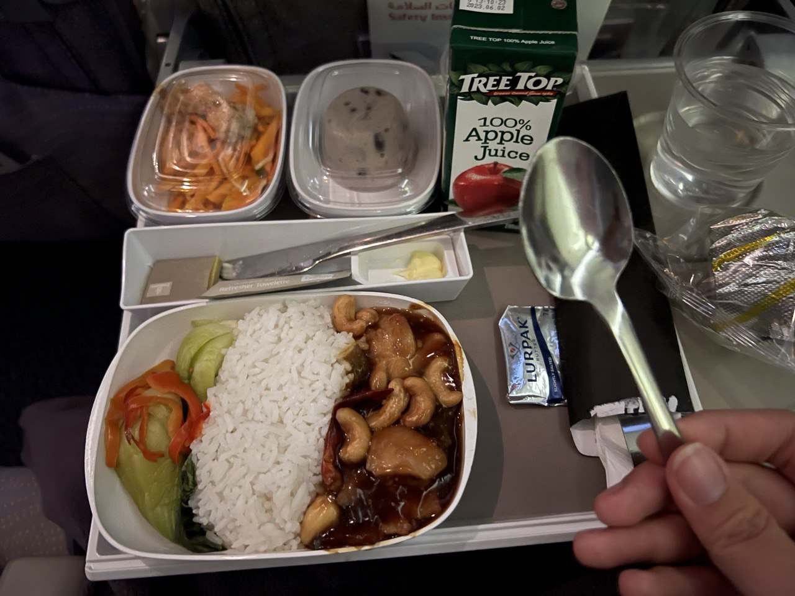

在若干小时的飞行后，在机身的颠簸中我望着舷窗外夜幕下像金色叶脉一样流淌的城市灯光，恍如隔世似的来到了泰国。

落地后会有中介派来带你过海关的服务人员（带过海关自然是加钱的服务），也是因为是落地签证的原因会需要这个，如果是正常签证的话也可以选择自己和海关扯皮。来人是个和善的老奶奶，拿着写了我英文名的牌子，会零星几句中文。素万那普国际机场的指示牌也标注了中文（感慨终究还是亚洲天朝周边）。

老奶奶只带我到机场出站口，剩下会有医院的专职司机来接我。不过也不算意外的我被司机放了一会鸽子......(这个司机在后来的来往医院旅馆的过程中每次都放了我鸽子......)

从机场到下榻的旅馆已经是快接近凌晨一点的时间，泰国机场高速上这个点车流很少，司机开得非常快。似乎和国内道路上那昏黄的路灯灯光一样，路边时不时掠过的高大广告牌，建筑很熟悉城市景色。但是新奇的右舵车和广告牌上的泰文又提示着我这是一片陌生的城市，与此同时还有的是车内若有若无的香料味。印象里泰国以及种种亚热带似乎是盛产香料的地方，所以连车上也是这样？

到达入住的酒店，司机也帮忙做了部分check in的工作。因为太晚了旅店的工作人员表示：您可以今天先入住，明天再来详细办入住相关的手续。不过说回来这家旅店也不是过关的时候入关资料上写的，入关资料只是为了走流程，最后实际入住的酒店和资料上还是不一样的。资料上定点酒店会在之后取消订单。

终于，在这样一个完全陌生的世界躺下了。酒店是一家类似别墅风格的酒店每个房间都是一个单独的小房子。基本上是一室一厅一卫的搭配。对，有厨房冰箱，当然想来术后也没多少人有精力做饭就是了。装修很是复古，有点上世纪的风格，但是很干净整洁。门口有长椅，有趴着藤类植物的雨棚和温润的灯光。以及超级无敌硕大的蜗牛，当然还有猫猫！酒店也有泳池健身房，不过还是因为大健康时代并不营业。虽然术后修养肯定又不到就是了。酒店是医院指定的，所以这里也有很多其他的姐妹。术后出院后会在这里修养直到复诊正常可以回国。
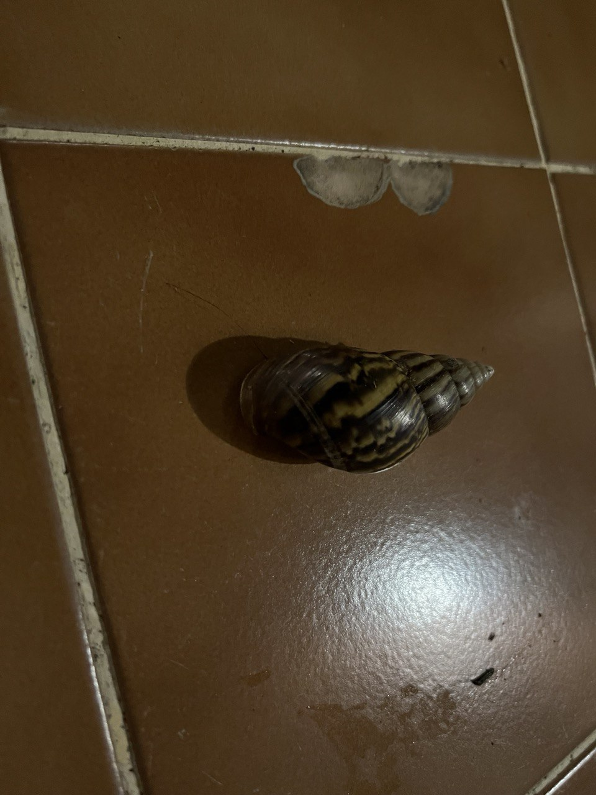
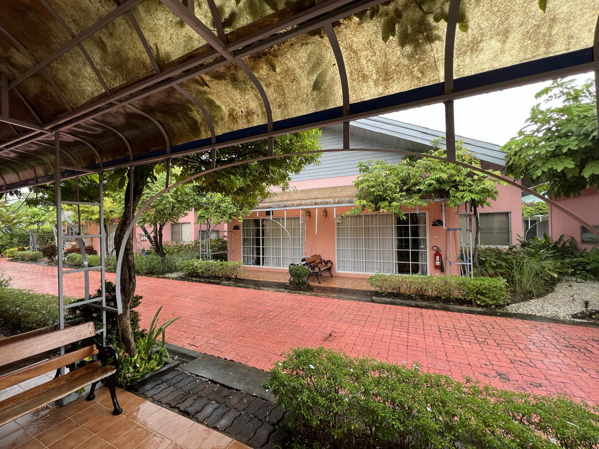

## One - Arrive Bangkok

抵达当日的疲惫立马被第二日的新奇所击败。八月末的曼谷依旧是炎热的天气。酒店里有个佛堂，路过可以闻到袅袅的檀香，当日应该是说整个泰国到处都是佛堂，佛塔。市中心最繁华的CBD旁边就是一个佛塔，可以看到很多鲜花和贡品在佛塔台阶上。

所以第二天干嘛了呢——自然是逛逛逛以及吃吃吃咯。去见了几位同行的姐妹，有的和我一样是术前的，早几天抵达。有的是术后的，过几天就回国了。

不过吃吃吃是因为...术前三天左右就要开始节食了（只允许流食），前一天禁食。而我的手术排期特别紧，27号落地泰国，次月2号牛子落地...于是乎能吃能跑的日子只有5天...

当日术前的日子里还需要面见心理医生，以及面见主导医生聊手术方案（语言的话中介会充当翻译，当然如果你英语过硬也可以自己和医生对话一些。或者你泰语过硬...）缴全款之类的。心理医生的话是因为泰国方面手术要求有两位心理医生对你做过心理咨询确认你的手术意愿并出具证明。当日如果你在国内有时间可以找国内的心理咨询医生出具相关证明，这样可以不用在太过花心理医生的钱。不过我手术排期并没有留给我在国内找心理医生的时间，而且光是做一些术前检查的就已经够麻烦了，心理医生都不知道国内哪个医生愿意开这种东西，我可能又要经历一遍被医生轰出来的过程 2333.

当然也有一些术前需要买的物品，毕竟术后得在床上躺好一段时间，没法自由活动，有一些必备的护理用品得提前买上。当然不同医院的护理要求不一样，所用到的物品也不一样。我这边的话大概就是：卫生巾（超大夜用款）

> _因为你会在接下来的半个月内补上这辈子欠下的姨妈期_

以及护理垫：因为会侧漏...

当然也有的医院的护理会要求用到碘伏和生理盐水，这两样东西用量很大，而且很重，得提前买足。

### 有关泰国的一些有趣的事实

- 泰国的某些物价确实相较于国内很低：举个例子，便利店里的类似国内“鱼趣”的产品，海苔一类的基本上20泰铢左右一包，约合4rmb. 当然打车特别贵，这里特指grab网约车...不过其他非泰国本地生产的东西就未必便宜了，例如索尼相机等电子产品？~~sony的相机和国内相比几乎就是原价~~
- 泰国“叶子”是合法的东西，在商场偶尔会有专门的柜台卖含有叶子的产品。当然基本都有醒目的标识而且在专门的有醒目颜色的货架上。~~类似国内自媒体危言耸听的一不小心就可能买到这种话术，我相信只要是有正常认知能力的应该不至于，呵呵~~
  
- 泰国有敞篷公交车!常见的是一些用货运皮卡改装的公交车，货斗加装雨棚和围栏就变成了公交车？甚至有一些校车都是这个配置，年纪稍大的学生会在末尾门口守着“门”~~因为实际没有门，年纪稍小抓不稳可能的掉下去？~~
  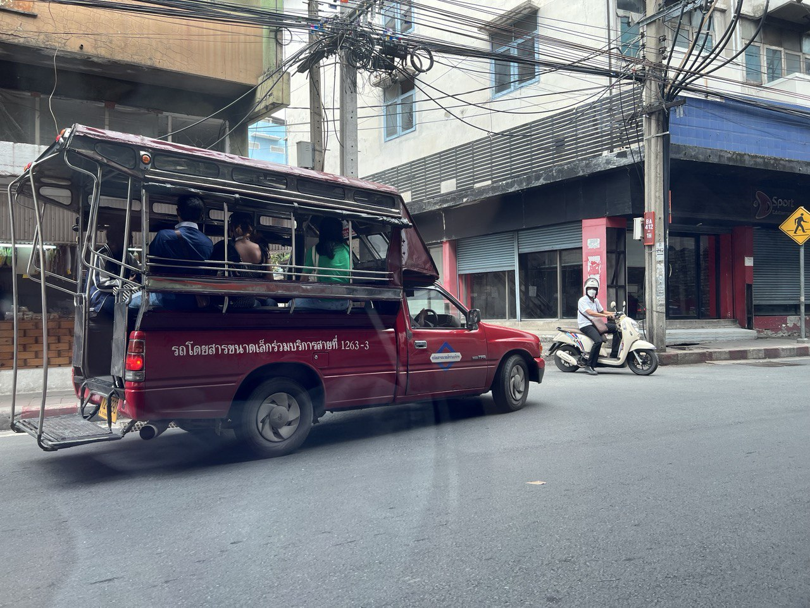
- 泰国也有海底捞——目前似乎是唯一的一家，在市中心CentralWorld
  

总的来说，就整个城市而言，繁华的地方特别繁华堪比中国的一线城市。但是也可以随处可见破败荒废的楼宇，以及每时每刻都在堵车？这大概是大型城市的通病吧。

## Two - Before surgery

欢乐的时光总是短暂的，很快就来到了禁食的日子里。

> _其实是前两日流食，第三日禁食，只允许和糖水，例如可乐。但是我是个狠人索性，~~其实是没看清要求~~三天全靠糖水度过。同时哪怕禁食了还在四处乱跑着玩_

最后一天，也是受难日开始的第一天～
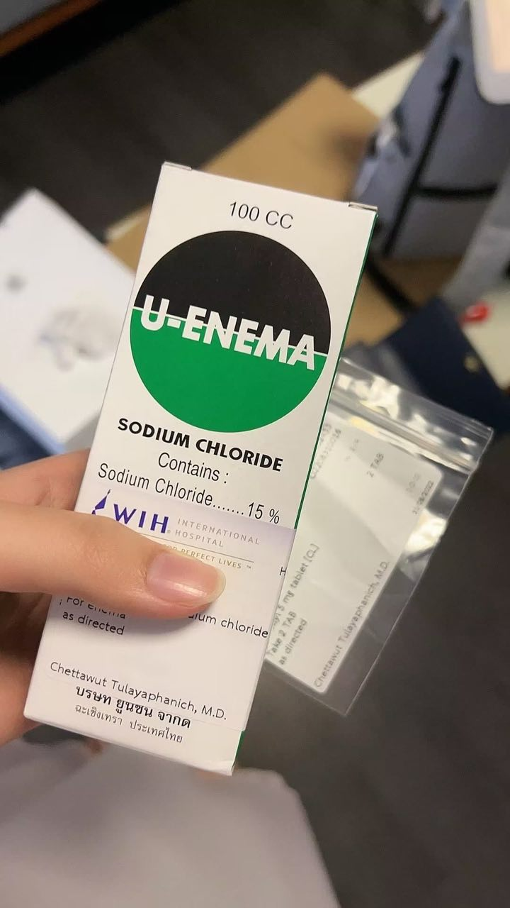

术前最后一天需要吃泻药，先是药片泻药，再是液体泻药，俗称雪碧？大概是因为包装是绿色的？还是说和雪碧混着喝会能接受一点。

药片泻药是开胃小菜几乎没什么感觉，但是到了液体就不一样了。可以说是被焊接在了马桶上...在喷水...喝的同时得保证电解质的摄入，推荐便利店卖的大瓶椰子水（至少我很喜欢，嘟囔）

> _题外话，入住的酒店每天提供早餐。术前可以到饭点去餐厅，术后的话每天会给你送到房门口。而且每天会有保洁打扫，每天房间除了提供瓶装矿泉水外还有可乐和雪碧_

PS： 手术前安排和主刀医生面诊的时候也会给你参观术后病房。私人医疗的配置是真不是盖得，医院的环境可以说是不像医院了233，有专门的前台，会客厅。以及住院病房全部都是单人间带有电动病床(这个床超方便，一个人也可以很方便的实现自理)，电视机，以及单独的浴室和洗漱间，以及一个陪床人员可用的小沙发。

电视免费提供网飞账号，所以术后在病房的日子都靠看美剧打发时间了，当然后面休养的时候也是？

对还有超大的落地窗！据说这个医院是主刀医生干了这么多年这几年才自己出资盖好的。所以也可以算是最新落成的所以各种条件设施都是当时比较新的。

## Three - True Zero

Times fly～

终于到了术前第0天！手术是安排在上午~~还是下午来着...忘了~~,反正是在白天，所以早上六点就会有医院的司机接去医院。但是我说过：

> _这个司机在后来的日子里都在疯狂放我鸽子..._

也有可能是早高峰的原因，总之司机迟到了一点。

到医院之后先是换上病号服（手术服）以及专门的拖鞋，泰国私立医院的病号服甚至还有一点好看，颜色是深褐色搭配紫色的封边，和医院整体颜色设计是挂钩的~~而且是开档的~~.当然我一开始穿反了，病号服是类似大褂一样，但是是反穿的开口在后面.当然我其实听懂了护士说要反着穿的,但是那样觉得好怪异（所有的医护人员都可以和他们英语交流，这一点到后面日常生活中的外卖员，路边小贩，出租车司机等也是），所以出了更衣室后被护士看到了被护士姐姐当场扒了重穿...

换好病号服后会带去自己的病房，然后等待护士来给你备皮~~羞耻时刻~~.当然趁着等护士的时间跑去看了看之前比我早来几天的姐妹，比我早来几天也是比我早几天手术。手术后会憔悴好多，不过好在人家是亲妈一起跟来的。当然这位妈妈后面也给了我很多照顾，在这里非常感激干妈～

备皮和一些生理体征检测完成后，护士会提醒要摘掉身上所有的金属饰品：耳钉项链等。可以放在房间带锁的柜子中。不过其实这里安全性是值得保障的，住院区不是谁都可以进来的，除了医院人员，其他人进入也必须有医院人员协同。私密性以及安全性拉满。

然后就是漫长的等待，到了预定手术的时间，护士直接推着轮椅来到病房。接下来到手术室的路可以坐着轮椅过去。~~人生第一次坐轮椅了属于是，不过其实后面还有很多机会...~~

手术室在一层好像，护士们推轮椅到手术室外后会让你躺上类似担架的床，把你推进手术室。

印象里引入眼帘的是巨大的无影灯，一些简单的器械等？看起来手术室的陈设并不算复杂？到了手术室内会让你转移到手术台，然后病号服会被脱下来盖在身上。感觉自己像个太平间的尸体2333.手术室的温度很低，除了病号服就几乎全裸的我到后面冷得发抖...过了一会有护士给戴上了心率检测仪（就夹在手指上的那个）以及做了输液。又过了很久，一位年轻的医生跑过来和我打招呼，自我介绍说是这次手术的麻醉医生，并且说主刀很快过来。U1S1这位麻醉医生很帅（虽然戴着口罩），以及主导医生也咕咕咕了好久，说很快但印象里我看着手术室的钟走了两个点......于是在这两个点里我一个人在手术台上冻得瑟瑟发抖。

终于大概是到了下午一点多？说是十点，十一点手术吧被推到手术室，但是好像把我拖到了下午，主刀医生终于来了，依旧是那副笑眯眯的慈眉善目的样子，笑眯眯的说手术很快开始，然后又过了十几分钟，麻醉给我静脉注射了麻药。

睁眼看着麻药被推进去的，但是就在这过程里脑子一下就抽过去了。

下一次再度醒来已经是接近八个小时过去后在观察室里，意识很模糊，大脑还没从与麻药手里夺过身体的控制权，只感觉身体很沉重。之后护士推着病床把我送回了病房，合力从可动担架上转移到病床之后那时算是意识清醒了一小会，看到隔壁干妈来看我，躺在自己病床上的我努努力挥挥手，然后就又昏睡过去了...

到了后半夜才意识逐渐清醒过来，当然也没有什么力气，下体也没啥感觉。仿佛啥都没发生，当然这只是因为麻醉还没过去罢了。其实出了手术室后一直在吸氧，但是我觉得那个在鼻子口的氧气管好痒好几次自己扯掉2333

在医院的每天双腿会被垫高以及保持分开状态，然后各绑着一对不断充气放气的东西，类似量血压用的那个但是在不断冲放气。当然后续了解到这个是起到一个腿部按摩的作用，帮助你恢复脚部神经感知。但是真的很难受，尤其是哪怕睡觉也开着，一方面是机器噪音，另一方面是你可以想象无时无刻有个东西捏你的小腿在配合上开始捏的时候充气的声音，以及捏完结束放气的声音，以及你知道这只是一个轮回马上就会开始新的一轮——巨折磨。

当然也是后来知道，其实可以喊护士晚上给你关掉的，呜呜呜......

在医院住院的期间也会提供三餐，但是因为还没有拆包（下体现在被裹的严严实实的~~只留了个屁眼子在外面x~~）所以前几天提供的是很清淡以汤和饼干饮料等为主。同时一起送来的还有每餐要吃的药，包括消炎药以及止痛药等。当然吊瓶也是不会停的。说回餐食，除了饼干之外的送的汤其实有几种，但是个人不喜欢西式奶油蘑菇那种浓汤，于是一般喝两口就不吃了。但是在有一次上了一个类似紫菜蛋花汤汤的蔬菜汤我喝完了之后，大概是医院的人以为我更喜欢紫菜蛋花汤，于是接下来的每一餐都是紫菜蛋花汤！！！！于是我过上了顿顿紫菜蛋花汤的日子！！！！暴雨哭泣。当然这也为我后面下地留下了隐患，这样的餐食真的没有多少糖分，然后一下地你就可能低血糖晕倒。所以推荐后面的姐妹在下地当天可以找人买瓶可乐，或者吃点高能量的东西，不然真的会晕。

## Four

>术后最难受的不是第一天，而是第二天。

因为到了这一天基本上手术的麻药劲就过去了，你可以开始逐渐感知到下体的存在，感知到痛，感知到肿胀感，当你尝试类似坐起的姿势或者上半身角度较大的姿势的时候会感觉到明显的下体的坠痛。

这时候会有那么一两个夜晚非常难熬，疼痛，发热会不断折磨你。当然这时候可以和护士说，护士会给你一片额外的止痛药。如果疼痛还是无法缓解会给你上吗啡。

但是吗啡其实扎完并没有好受太多，你会依旧感觉到痛苦，不过意识会逐渐变沉，你会很快昏睡过去。所以至少依靠它你可以熬过这样一个难熬的夜晚。

当这最难熬的一两天过去后我才真正有精力审视术后的自己。当然哪怕这之后以及iu很难熬，因为你几乎无法转身，没有办法侧睡。当然也不是完全没有办法，可以用枕头把两腿撑开侧躺，只要你不怕痛的话。

下体被弹力绷带以及厚重的胶布裹着，其中会有一根引流管以及导尿管延伸出来。每天会有护士查看你引流管的状态以及帮你处理尿袋。当引流管内出血逐渐减少后会给你拔引流管。个人评价我觉得这是最痛的步骤，在拔之前会护士会提醒你吃一点止痛药，拔的时候你可以感觉到一根管子从你血肉中抽出的感受，连带着途经过程中刺激上伤口引发的抽搐痛，不过护士手很快，基本一下子就解决了。然后下体就只剩下导尿管了。当然其实之前胸口一直有一个麻醉泵来着（其实也是后面才知道这个东西是麻醉泵），麻醉泵延伸出一根极细的透明的管子连到腰后尾椎骨的位置似乎。
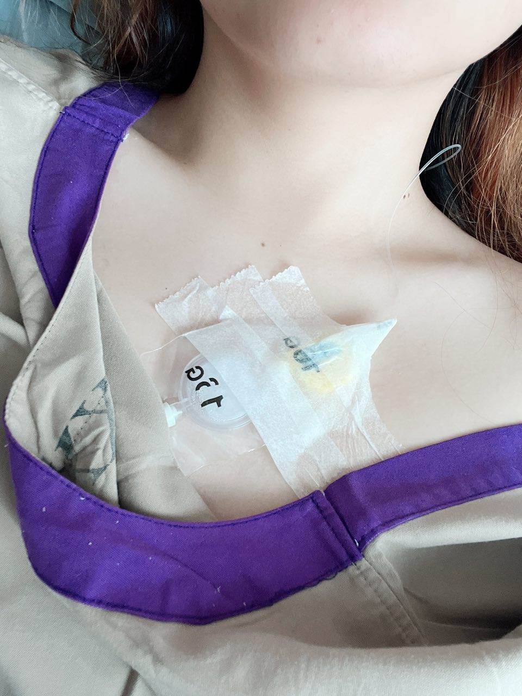

在医院的那几天每天除了喝紫菜蛋花汤就是刷美剧《僵尸国度》~~当然偶尔还有来自比我早两条手术的那位姐妹的性骚扰~~

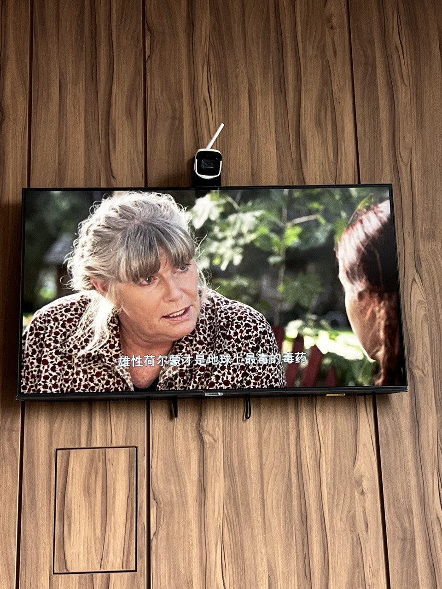

在术后第三天晚上的时候作死自己尝试下地，差点晕过去，好在快要晕倒之前按下了护士铃。同时以及拔了引流管后就一直在飚血，当时很感叹自己能不能明天出院。

> 所以手术其实也是一个非常考验心态的过程。术后休养的日子里，身体的痛苦，行动的不便，血肉模糊的下体都可能让你的心情变得非常糟糕。当时有一度怀疑自己能否活着离开泰国？当然这是夸张的想法，因为会担惊受怕担心留下后遗症等等。所以如果是原先就有心理疾病的姐妹一定要注意调整好自己心理状态做好心理评估再决定手术。

在手术前医生会询问你现在最近是否有吃什么额外的药物，尤其是治疗心理疾病相关的。一方面是给麻醉等用药做考量，另一方面是为术后恢复做评估。在术后如果你精神状态及其不佳，医院也会提供类似镇静类药物以及安眠类药物等。当然你有一些之前持续服用的精神类药物，在医生考量安全后术后恢复住院的过程中也可以让护士拿给你吃。除此之外每天会有护工安排给你擦拭身体，更换病号服和床单整套之类的。

不过即使是拔完引流管后一直飙血的状态下，医生还是安排出院了。这里要吐槽无论你问医生或者护士你啥啥啥情况咋回事他们都只会用英文告诉你：Oh, that's ok. That's normal.某种程度上这也是让人焦虑的原因之一。

出院那天，依旧是护士推来轮椅。所以昨天下地差点晕倒的我今天就要坐着轮椅，坐着救护车，对，坐着。在救护车上是坐着的状态经历一路颠簸回到旅馆，这期间全靠双手撑着座椅来给自己下体减少一点压力。当时的面色几乎是可以用惨白来形容。

当然其实是可以申请多住两天病房的，资本主义的世界加钱就是了，但是优柔寡断的我在反复横跳之间被迫选择了出院。不过好在确实没有遇到什么以外情况，除了有些飙血后续恢复还算顺利。不过其他姐妹不要学哦，有条件的话觉得自己无法自理（毕竟回了酒店就要自己拿吃的喝的洗漱上厕所倒尿袋啥的了）还是多住一两天吧。

## Five

回到了旅馆。说回来旅馆一开始预定的时间以及缴的钱是从入住那天到最后离开泰国，不过中间你去住院的手术是可以不算钱的，但是房间还会为你保留，你的行李也会被保管在你的房间内直到你出院回到酒店。

回到酒店之后每天也会有医院的护士来查看你情况（其实酒店距离医院也不算远来着，而且这里本来就是医院专用的酒店之一），护士会询问你状况以及帮你做一些基础的护理，测量血压等身体指标，清理伤口等。早餐的话之前说了酒店会有餐盒送进房间内，吃完之后餐盒放到门口椅子上会有人统一回收。酒店的早餐就丰盛一些了，以下是酒店早餐（其实医院的三餐也可以很丰盛，但是因为术后一开始是流食管理所以我没能吃上啥好的东西）
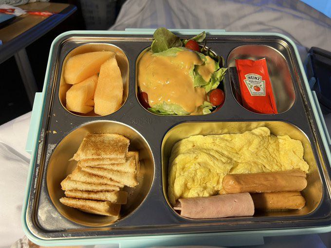

据说其实有中西餐样式可选，中餐的话会有炒饭，不过我也懒得和工作人员提，一直吃得西餐款。基本上就是煎蛋面包黄油沙拉香肠培根和水果。

八九月的曼谷正值雨季，说实话在时节上是选对了，因为很喜欢下雨的我。

热带的雨季，时不时会伴随着雷暴天气，躺在酒店屋子里的听起来就是纯天然的白噪音很舒适。听着雨滴打在屋顶上，窗户上的声音，隐隐的雷鸣伴随着蛙鸣。当然也会有很大声很吓人的响雷啦，不过我可不是害怕打雷的小孩了。不过一样住在这里的其他几位小姐妹就未必了2333.

其实到泰国来做手术后发现，能走到手术这一步并且来到泰国的跨性别者大多数都是很努力亦或者很有天赋能力的一群人。因为天朝的愚蠢规定哪怕成年了手术也需要父母同意，所以能来泰国的大多数都是自己努力过来的。又同时因为出国手术是一笔不菲的费用所以能自己努力过来的又大多很是优秀。例如就认识了一位虽然还是学生，但是已经可以做讲师在外讲课的大佬，亦或是年纪轻轻百万存款的有为青年，还有大学被迫辍学却自学成才高薪收入的大佬。相比较之下我这个失业社畜反而相形见绌。当然也有家长支持过来的，因为觉得泰国的技术毕竟更好一些，但是在这个圈子里家长党真的是少数。更多的是这样一群努力活着的人，也希望更多的人能过上自己 想要的生活。

> 不像普通人一样，这个圈子里的孩子们还需要与几乎整个世界为敌，当家庭这种被誉为港湾的地方也演变成吃人不吐骨头的浅礁石岸，唯有只身一人对抗充满暴雨雷霆的大海。

自住院以来其实一直没有机会洗头，所以直到第六天我的毛已经近乎成了鸡毛毽子。于是乎在我绝顶的聪明才知下，我完成了在未拆包情况下一个人给自己洗头的壮举。

其实是依靠酒店床尾的躺椅，把它拖到厕所里然后躺在躺椅上用花洒给自己洗头。当然这一番折腾下来我连吹干头发的力气都没有就瘫软在床上了。

在酒店的日子早餐以外就得自己的点外卖了。术后医生有叮嘱饮食上不能太过油腻，油炸制品，或者海鲜等不推荐吃，所以kfc是不用想了（当然其实自己也吃了点问题不大，但是警惕还是要遵医嘱，因为有翻车的），同时术后也推荐你使用蛋白粉一类的，也就是说饮食要多补充蛋白质以保证身体恢复，然后医院有推荐一种蛋白粉。但是我想了想与其把钱花在难吃且贵的蛋白粉上（其实据说味道还不错），不如多花点钱在点的外卖上，于是那段时间我就各种牛排的炫。太过也有类似国内的外卖软件，不过有意思的是泰国的外卖员很多都是自行车送餐。当然时效还都可以保证，而且自行车想来他们应该不会像国内美团饿了么那么卷吧。

每一个外卖员在送餐完成后都会说一句“卡昆卡”，大概是泰语里谢谢的意思。其实不止外卖员，所有为服务你的人，亦或是各种人与人之间都会很礼貌的互相道谢，在这点上天朝国内就是完全截然不同的感觉。当然我不是土生土长在泰国的，不知道这个算是表面功夫亦或是发自真心的，但是在中国，哪怕是表面功夫的人与人之间的礼貌似乎也消耗殆尽了。

## Six

第七天，是拆包的日子。拆包自然就是指的是拆开下体包裹的纱布等等。

早在前一天护士查房的时候就叮嘱明天查房前记得吃点止痛药，也算是打预防针拆包可能很痛了。当然实际我个人的体验还好，没有太过不适。其实拆包我录像来着，但是被护士制止了，似乎是商业机密？还是啥别的？

所以时隔七天下体的封印终于解除啦！

护士显示拆掉一直以来的弹力绷带束缚，然后是外面的脱脂棉等，不过可以看到几乎全是黑褐色的淤积的血液就是了。然后最重要的部分，从阴道内部取出医生塞进去的纱布填充物。一直以来术后 其实可以感受到下体是被“填满”的，很硬很难受，其实就是这些沾满黑褐色血液的纱布。护士揪起纱布的一头然后缓慢向外抽出挤在一起的纱布，略感粗糙的纱布刮过阴道内壁是可以被清晰感受到的，而且因为阴道的深度，一段填充纱布是不够的，抽完之后还需要用镊子伸进去揪出另一段纱布的头，然后继续。在护士犹如哄小宝宝一样的安慰下最后全部的纱布取出，接下来就是即将伴随你一生的操作——通模具。

为了防止阴道萎缩，需要在接下来的两年内保证每天一日三次一次一小时的通模具，也就是用一根根亚克力棒棒塞入阴道以保证阴道宽度和深度。并且模具有0-5号多个宽度尺寸，你需要在未来的日子里逐级提升以拓宽阴道使其可以使用，同时也是为了术后防止愈合长死...(当然其实现在的我不到两年就摆烂了，其他姐妹不要学哦)

护士会在拆包之后帮助你第一此通入0号模具，同时也作为教学教导你如何通模具。教学会在持续几天之后结束，后面的日子里所有通模具的过程都会让你自己来 。护士会首先用专用的润滑稿挤在阴道口，然后用带着医用手套的手指涂抹阴道口，之后用食指将润滑液送入内部，保证内部润滑完成后，会再挤上一点利多卡因凝胶（一种体外用麻醉剂，降低通模具中的痛感）如法炮制保证利多卡因凝胶涂满内部。之后就是给模具涂抹上润滑，然后插入......

第一次插入的同时会利用模具上的刻度测量深度，护士会告诉你深度是多少，并且以后通模具都要尽力保证到这个深度。当然在教学中有一次护士看我下不去手给我捅的交出来了~~捂脸~~

说实话，通模具其实可以说是这个手术最痛苦的部分，当然其实不同医生不同手术的实现效果不同，最后通模具的要求也不同。而我这个的要求则是术后两年内，每日一体三次一次1h,两年后保证一周一次（在有规律性生活的前提下），然后这个几乎要伴随一辈子？说实话这样的要求很难保证，而且模具升级尺寸的过程非常痛苦，有不少人是手术的恢复痛没有掉过一滴眼泪，但是摆在了模具手上。也有不少人在术后不久就放弃了通模这个事情，因为太费时间精力以及痛苦了。当然其实也有相对而言轻松的手术方法，通模要求，但是基本上只要你选择了做人造阴道，那么通模这个过程就不可避免。

>**所以在这里对所有考虑手术的姐妹说上一句，手术并不只是开个刀这么简单，还有后期的护理维护。这些过程你都要作为你是否能将接受考量的部分，深思熟虑，三思而后行。**

其实直到真正拆包之后你才真正感觉手术做完了，因为幻肢效应在这之前你会觉得某个惹人厌的东西其实只是被包起来藏在了这对纱布里。直到你真正看到平坦的小腹，看到穿上胖次后再也没有的突起，内心才变得真正如释重负。

当然即使拆包的当天我还是没能摘掉导尿管，于是后面的日子里还是要滴溜着导尿管四处溜达（其实也没有四处，基本就在酒店）。拆包之后每天都要垫着卫生巾和护垫，毕竟时不时还是会飙血。与此同时我也体验到了类似姨妈的感觉，你可以在每天起床起身站起来之后感觉到下体“哗啦哗啦”流淌的感觉(这个拟声形容词还是我初中同桌描述过的)，同时也体会到了即使是垫着夜用也会侧漏的结果。这期间还花了点时间弄明白卫生巾哪一边是前面那一边是后面？

当然拆包还有另一个好处就是意味着终于可以洗澡了！

在拆包后的日子里，每日护士来了之后会帮忙做一些阴部的消毒，主要是用生理盐水一类的。其实我一开始不知消毒清理用的是生理盐水以为是酒精，所以头铁自己用酒精处理还没发现奇怪的地方。直到在某次询问护士护士急忙告诫说： No No No.

## Seven

第十天，是拔尿管的好日子，这也算是术后恢复的最后一道门槛了。

依旧是惯例提前叮嘱记得吃止痛药。然后就是在拔之前的一些其他的注意事项，拔掉之后要多喝水，如果拔完后几个小时内都尿不出来就得立刻联系护士，然后护士会回来给你插回去（防止尿道潴留）......

拔的时候感觉确实很奇妙~~感觉要是多来几次会觉醒什么不得了的play~~，在事后我也很顺利的尿出来了，避免了被二次尿道play。

当然其实还有一道坎是拉屎来着。毕竟自术前三天开始就没什么固体食物摄入了，后续在恢复正常饮食之后极有可能便秘。而且在术后恢复期内对于拉屎也有额外叮嘱，如果遇到便秘的情况千万不能用力，防止伤口因为用力撕裂。也就是哪怕拉不出来 不拉也不要勉强自己。实在拉不出来可以问护士要泻药。当然于我个人而言还算顺利。

闲暇之余找大学同学的妈妈算了个命，大学同学的妈妈在他们那边还算是半仙来着？其实是在考虑重新换个名字如果后面改身份证啥的。当然其实直到在写这篇文的时候我也依旧没有改身份证，因为需要出柜需要和家里人撕逼，迄今为止还是个地下党。当然这与我个人而言其实还好，毕竟现实生活里没有多少需要掏身份证的场景，同时已经女性化生活这么多年了。当然修改身份证会是这场旅途的最后一块拼图，希望以一天这块拼图可以被补上吧。

好了扯远了回到算命的部分，阿姨莫名还是很友善的，很理解我的经历和遭遇，当然我也没说过我的什么经历，算出来的？甚至说如果又需要后面回国可以去她家里修养。算命说法是我是一个非常心善的孩子，对待朋友非常好，但对父母倔起来很可能六亲不认。Oops,某种程度上算是很准了。同时说我是菩萨命，男身女相，可惜投错胎如果是个女孩应该会生活很幸福。hhh,或许吧。

在拔完尿管后遇到的另一个问题则是，你得重新学习熟悉尿尿的感觉，像一个幼儿园小朋友一样。学习尿尿的力道，坐姿，腿叉开多少才能保证不尿一屁股。当然这个还是和下体还没有消肿有关系。

## Eight

直到十九点，终于是有精力能够出门活动了。跑到了附近的商圈去吃寿喜烧巴拉巴拉的，肉肉！肉肉赛高！多吃肉肉才能更好的恢复 ，所以点了很多肉肉。通行的还有认识的另外一位姐妹。她和我不是一个医院的，但是跑来我们这边玩，趣味相投也就更多一起玩了。

在泰国有非常多的日料，其实相较于太过本土料理以及泰国的中餐而言，我更喜欢太过等等日料。泰国料理的特色是会加很多国内不太常见的香料，以至于味道会很奇怪，喜欢的人可能会很喜欢。置于太过的中餐，其实主要以港餐以及川菜为主。港餐有诸如煲仔饭海南鸡饭一类的其实不错，川菜的话，恢复期辣的还是少吃把，毕竟不想另一个洞也痛起来。

到了第二十八天，这之中除了每日按时通模具就是和各位其他姐妹约饭啊逛街一类的，也算是把泰国曼谷中心的商圈都跑了一遍。术后一个约左右是复诊的时间，如果复诊后没有什么异常的话理论上就可以回国了，当然要是有兴趣签证时间足够还可以多住几天。说起来落地签证中间需要办理一次续签，不过这个事情中介也会帮忙包办，只需要将护照交给中介即可。当然实质上交出护照是一个非常危险的举动，因为护照是你在国外的身份证，没有护照很可能寸步难行。

复诊当天还是那个司机会把你接到医院（对他又迟到了）。再次见到了主导医生，会询问一下基础情况，然后会被带到检查室。~~在这里人生第一次体验了妇科检查椅子，以及阴道扩张器~~

在躺上椅子后医生会把两腿放在两边支架上，随后会使用扩张器查看一下内部恢复情况。我选择的这位医生是出了名的会长肉芽。

> 肉芽: 顾名思义，是人体在身体内部出现空腔损伤后身体自发修复过程中长出的小肉块。

如果有肉芽一般会使用电刀帮你切掉（不打麻药的...）当然如果你实在觉得痛可以在给你打麻药，但是好像要另外加钱。除了这些流程之外还会测试阴蒂的敏感程度。~~啊，几乎就是用棒子给电了以下，下意识的就叫出来了！！！~~此外后还会拍照，照片可能会作为后面医院自己宣传使用吧，当然你也以要一份。

我个人情况是恢复的ok,也没有肉芽（说是没有但是检查的时候还是感觉医生用了电刀切了什么，因为闻到了烤肉的味道？）

到第三十二天护士来把外部的缝合线拆了拆，接下来也就会踏上回国旅途了。当然其实很多线材都是可吸收线，但是因为恢复的很好可吸收线反而成了愈合的阻碍（身体感知到可吸收线这个异物的存在会在缝合处发炎）

到了回国的部分，又是喜闻乐见的大健康时代的特色事件了。其实在泰国同样的时间除了住院的时候做了一次核酸已经很少能感知到疫情的存在了，商场里人流涌动，街头车水马龙。也没有人戴口罩，也没有大白，就像过往许许多多平常人日子一样，每个人安居乐业。当然我不属于这里，于是大健康时代的东西还是一样都逃不掉。

## Nine - Return

当时我自己的安排是泰国直飞香港，然后从香港走陆路从深圳入境。这之中的主要考量也就是成本了。自费隔离是逃不掉的，主要问题是机票钱。泰国直飞国内的机票价格当时被炒上天，走香港入境深圳算上隔离的钱还比不上这一张机票。其实到这里这场旅途就算是到达尾声了。不过因为受了之前干妈的照顾，而干妈的女儿想在泰国多玩会，因为干妈英语一般，于是我得担起把干妈送到机场的工作。而干妈是直飞国内的，所以相较于我飞香港还有很多额外的步骤。其中就是起飞前的多次核酸。

与飞香港只需要在上飞机前用核酸试纸自测并将结果展示给值机柜台不同，飞国内必须在航空公司指定的核酸检测机构做满多次核算并且结果无异常后才可以登机。当然这个指定机构的核算自然是要掏钱的，而且非常贵几次核算就要上千元。要带干妈去机场的我自然也要帮忙处理这些。

打车到专门的核算点之后就可以看到那些在墙里面常见的特色汉服了，同时核算点内的工作人员操着熟悉的中文在那卖力吆喝，所有人必须戴面罩口罩间隔一米核酸检测。当然在所有小唐人穿着汉服排队核算的时候我在一旁口罩也不带的看热闹，也挺有意思。上飞机当日，国内直飞航班也是需要穿着全套的隔离服带口罩面罩才能登机。在熙来攘往的素万那普国际机场形形色色的外国游人中，老中们组成了一道靓丽的风景线属实是。
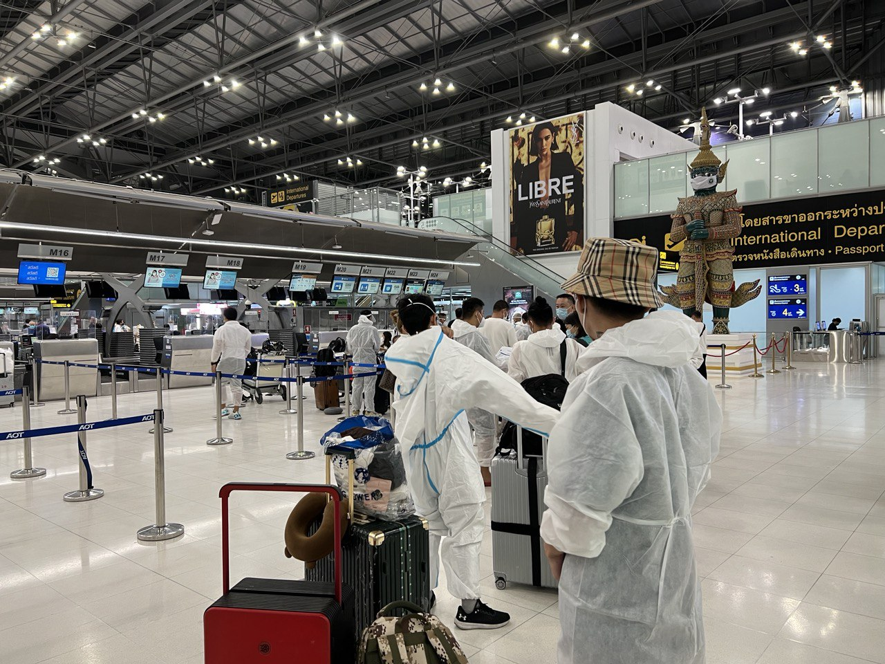

送完阿姨之后在机场，我接上和我同行回国的小姐妹后，两人一起做完自测核酸试纸就准备登机了。这之中还有个插曲，理论上手术后身体不适合长期步行是可以申请机场轮椅服务的，当然服务需要出具医疗证明。这个证明在出院的时候院方就给出了，但是到我在机场尝试申请轮椅服务时泰航的工作人员却告诉我需要十五日内的证明。然而手术已经是一个前的事情了？！于是无奈又打电话给中介让中介麻烦医院重新给一份电子的证明。但是这个情况之后泰国航空遇到了，在其他航空公司哪怕是国内航司都是只需要口头申请或者电话确认就可以安排，甚至连证明都不需要看。

有了轮椅服务之后会有工作人员一路推着到登机口上飞机，而且飞机上的普通经济舱也会帮忙免费升舱到舒适经济舱，同时优先登机免于排队。当然这两位泰航的工作人员还示意要了小费。

> 其实之前忘记提了，泰国也是一个有小费文化的国家，当然没有美国那么过分。我个人对于小费的态度是入乡随俗，毕竟多数服务人员真的很辛苦。某个暴雨的夜晚在酒店不小心打碎了可乐瓶（酒店送的可乐是玻璃瓶装的，顺便忘记说了我住的酒店房间是可以赤脚进入的，我一般也会选择赤脚），打电话给酒店前台后一位阿姨披着雨披跑来很细致的清理干净了，于是给了挺多的小费，当然本来这个额外的房间清理服务是免费的。

## Ten - Hongkong

抵达香港之后同样是会有航司的工作人员带着轮椅在下机口等待。然后一路推着来到香港入境处，临时入境的中国人可以在香港待的时间是有限制的。在入境香港后的入境深圳是需要抽签的，然后我和同行的小姐妹分别抽中了不同的批次，所以我在 送走她之后还可以在香港自己玩两天。

在香港的几天一个人玩的很自在，其实在后期我恢复的已经很不错了，相较于同行走几步就不行的小姐妹我基本可以在外头走一天。不过可惜的是没有去香港的本岛，更多的是在九龙一块区域玩，和香港本岛隔海相望。

九龙这块很多地方就很像九十年代港片里的香港一样，复古的红色出租车，高大拥挤的筒子楼鸽子楼以及琳琅满目灯红酒绿的港式招牌铺满整个大街，可以说港味很浓。当然香港的消费确实很高，虽然港币对人民币是1.1：1,但是10平米都勉强的房间要价700，一顿普通的盒饭基本要40,日常下个街边苍蝇馆子可能也要几百快，有点感叹穷人活不起了。不过从便利店打出的招聘来说店员的月薪都来到了1w8接近2w港币的月薪。

越是靠近维多利亚湾的部分越是繁华，维多利亚湾边上是巨大的K11商场，可以说国内装修上能够望其项背的也就南京德基的那个号称豪华厕所，但是也只是为望其项背而已。
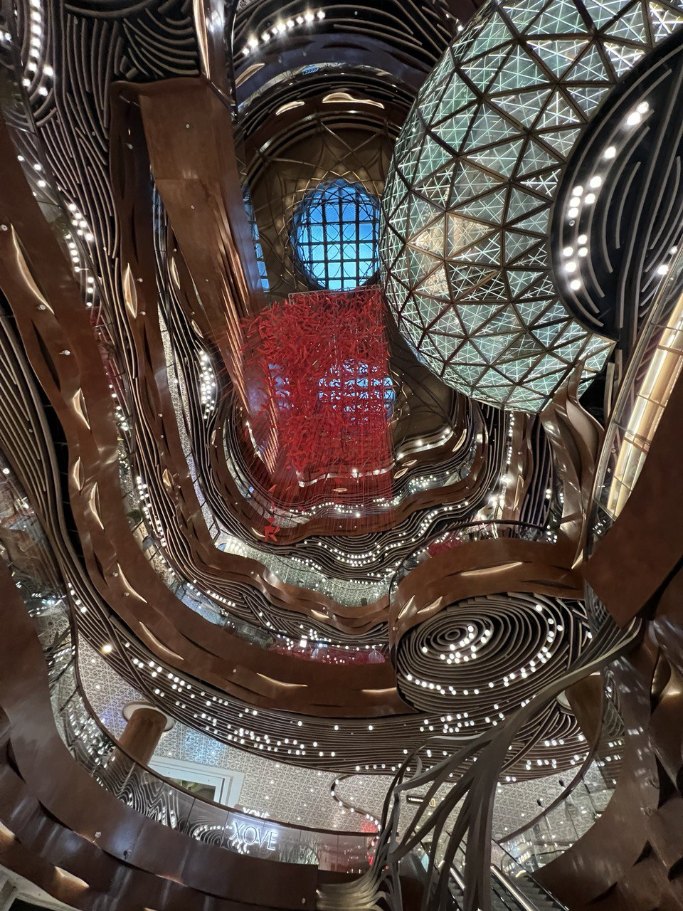

维多利亚湾可以说是印象最深刻的部分，同样是以灯光秀著名的港湾例如上海南京路黄浦江这样的国内景点，维多利亚湾给人的感受就会舒适很多。而不像国内那种人声鼎沸人挤人的状态。当然也有可能是因为我去的时候是疫情期间旅游淡季的缘故？

湾边三三两两的行人，路灯杆上的广播中放着舒缓的音乐，吹着迎面而来的海风，这才会真切感受到游玩的乐趣。而不是像南京路一样，放眼望去都是人，被人推着走过一边游客就算来过的氛围。在一旁的星巴克点一杯咖啡，看着一边的景色，非常惬意。
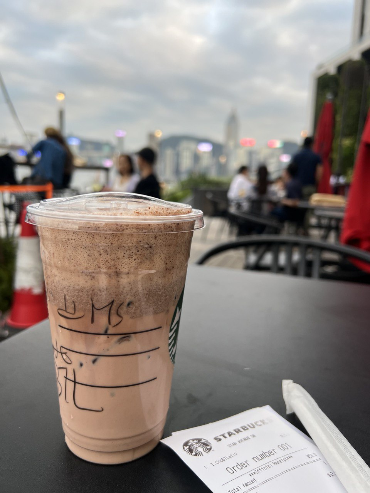

维多利亚港旁边就是闻名的香港星光大道，在这里可以看到很多港台明星留下的手模，当然还有算得上是香港吉祥物的麦兜。
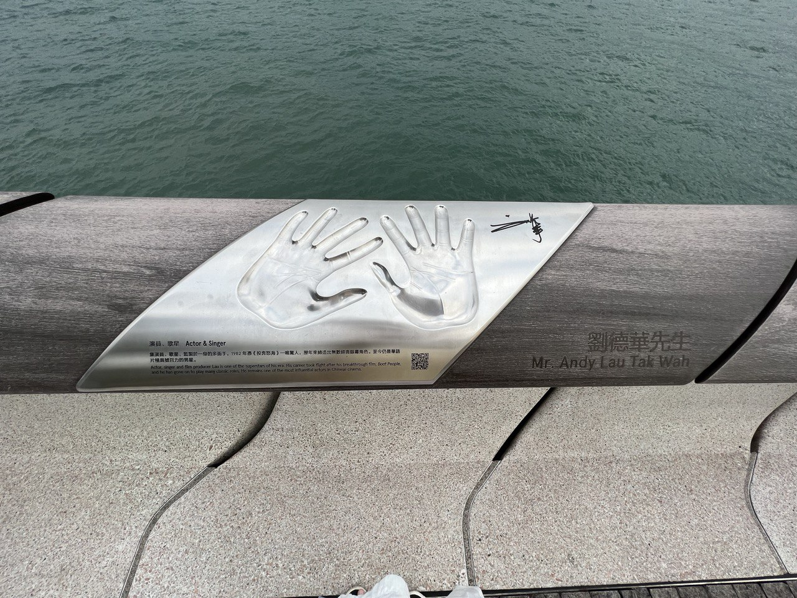

到了晚间特定的时间点会有灯光秀。如果有兴趣的朋友可以提前确认好时间去等着，似乎有两场。我是跑到岸边逛街才知道晚上会有等灯光秀。夜晚的维多利亚才是更符合记忆内香港的感觉。

当然在香港入境前还需要每日做核酸检测，当然香港的核酸点其实也多数是为了大陆人服务。香港人自己基本不太做核算了。而且讲道理我们入境之后必须采取自我隔离的态度，不允许去什么公共店铺吃饭之类的，但是依稀记得有个餐馆的老板的态度是去他妈的核酸。

一些有关香港有意思的事情，在九龙有很多歌舞厅，这一点香港给人一种还在上个世纪的恍如隔世的感觉，门口招牌上也是宛如上世纪的风格。搭配上复古的灯牌，老香港的味道。同时还有一些有意思的店是会有簧片专卖店？当然没有进去过，似乎是书籍和CD都会卖。甚至路边还会有摆摊卖小玩具的，提到小玩具其实还要说一嘴：

> **在泰国色情玩具和赌博是违法的，如果携带玩具或者是纸牌一类的入境可能要注意？**

目前为止，是我旅途最后一段在墙外了，说实话还是比较珍惜这段时光的。世界真的很大，应该多去看看。

## Eleven - Back to wall

入境深圳那天，我是坐公交车到尽量接近深圳的位置，香港的郊区，然后打车到深圳口岸。这里吐槽香港的计程车是真的非常贵，十几公里的路程花了一百多元的。当然这主要是因为没有任何公共交通可以入境大陆了。

到了深圳口岸就得步行到入境点了，除了常规入境需要的安全检查之外还有大奖抗时代专属的核酸检测等等。在待遇上感觉自己从国外回来就感觉是被当成了“汉江怪物”

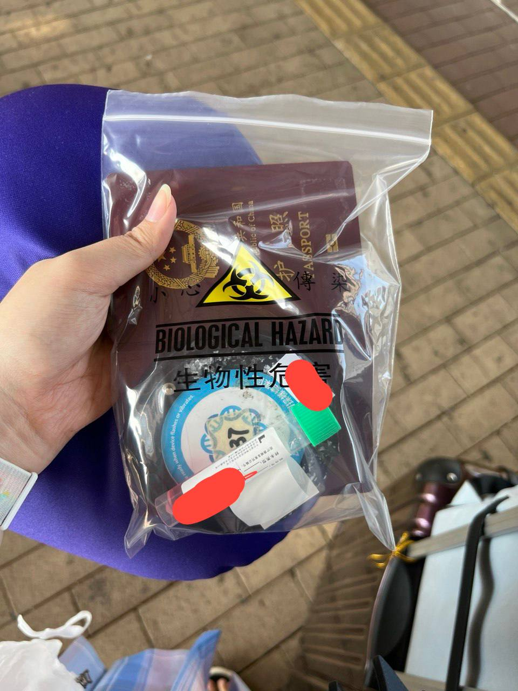

在实时核算结果出来之后就会按照接下来的去向被送去不同的隔离酒店。在隔离酒店住满xx天后才可以“刑满释放”，不过即使是“刑满释放”也不允许随意走动，比如自己跑去坐什么公共交通之类的。如果准备接下来前往广东境内只能是有亲属来接，或者自己打车前往接收目的地，且目的地居委会等管理机构声明接收才可以，不然的话就只能被去深圳机场，或者继续隔离。所以其实后续讲道理我应该回到广东，但是因为这个傻逼政策的缘故只能先跑上海投奔别人（能来机场接我），待满多少天等境外行程码消掉之后才能回到广东。

所以这场旅行终于算是告于段落，回到自己的小出租屋后我有干嘛呢？被二号模具捅到自闭，然后继续躺尸，然后找了个工作，然后离开了广东去新的工作，然后被新工作派去鸟不拉屎的山区出差，然后气愤离职，然后再度入职，直到现在...

所以

Trans之外，人还要生活，还要工作，学会生活，学会自力更生，生活不止Trans.世界很大，多去看看。