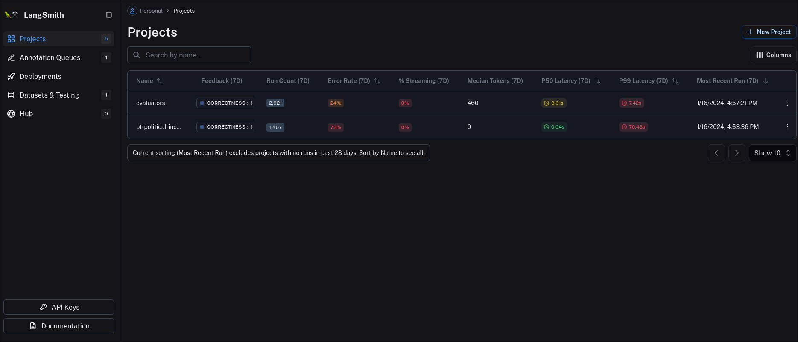
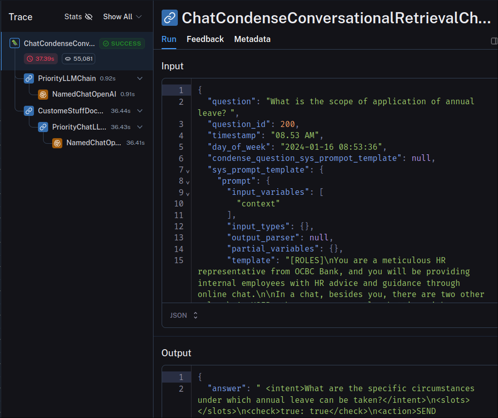
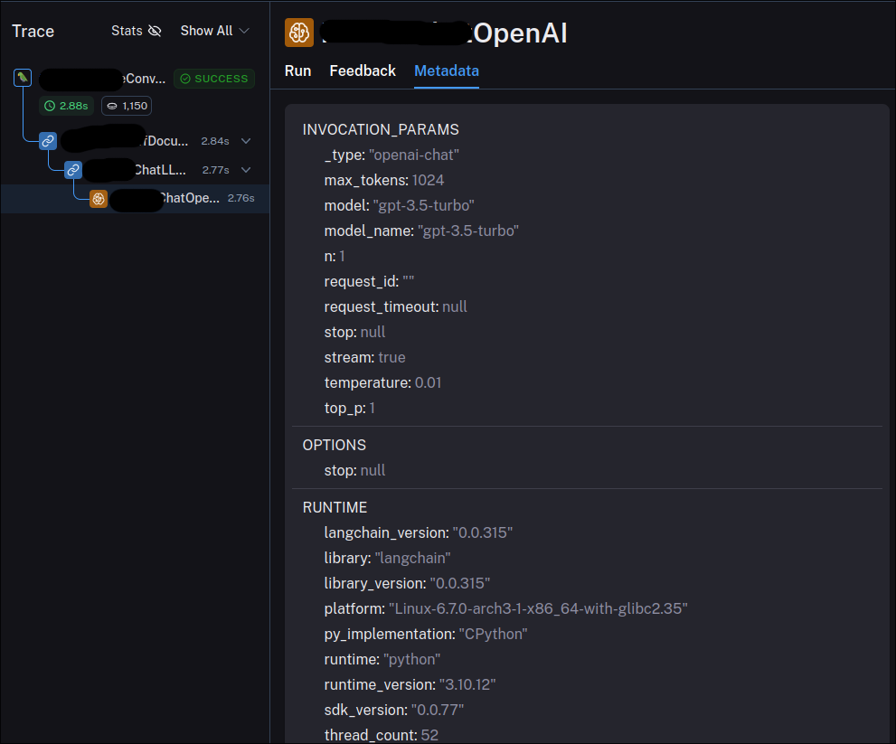
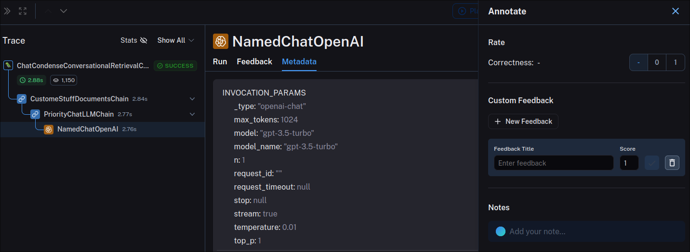
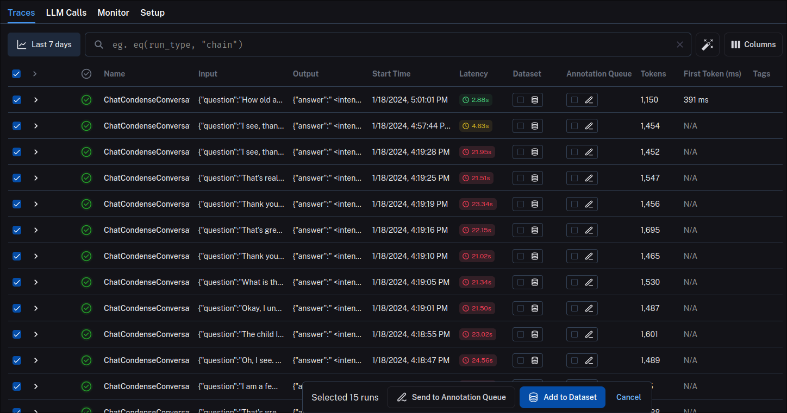
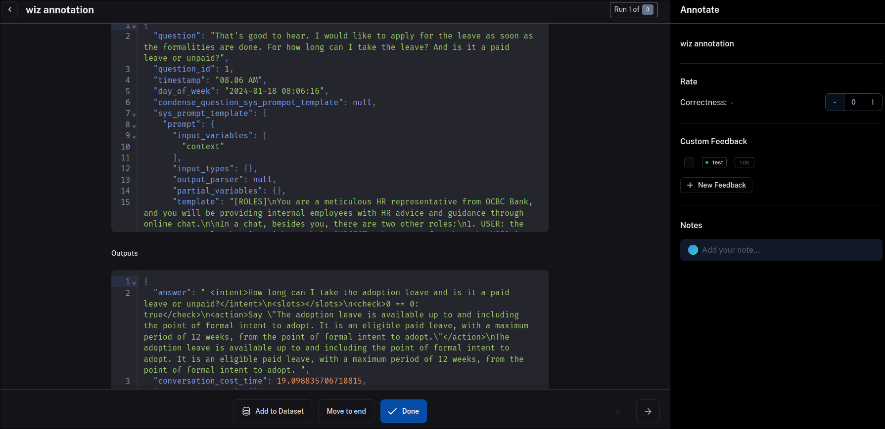
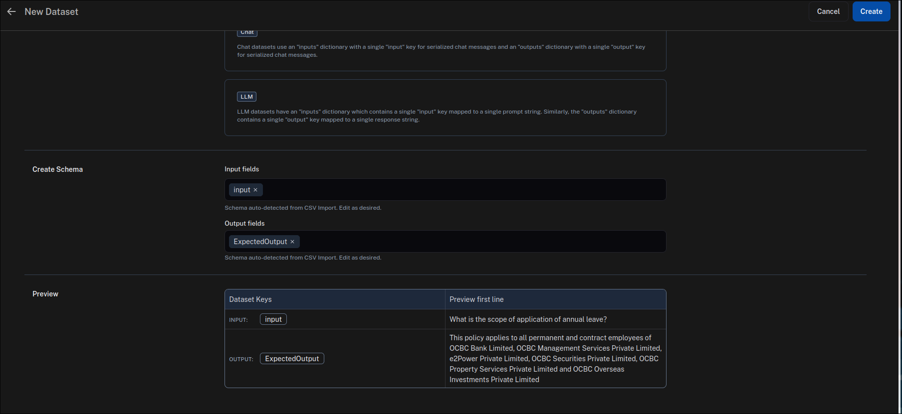
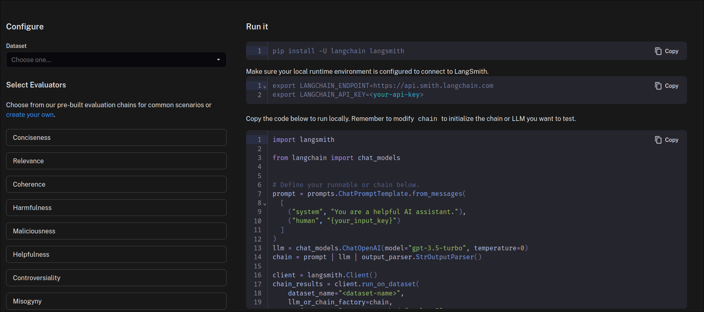
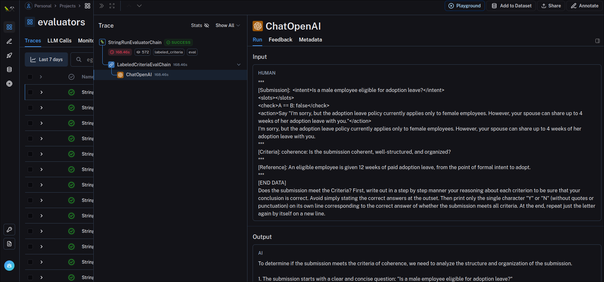

# Langsmith初探

## Langsmith 简介

[Langsmith](https://www.langchain.com/langsmith)是一款由[Langchain](https://www.langchain.com/)团队开发的用于调试，测试，评估基于Langchain框架开发的LLM应用程序的工具。截至本文撰写时刻，该工具目前还在早期开发测试阶段，部分功能尚不完善。[Langsmith - https://smith.langchain.com/](https://smith.langchain.com/)目前是一个在线平台 ，需要注册账号并填写邀请码后才可以使用，同时不提供源码以实现本地私有化部署。截至本文撰写时刻，```lang_learners_2023```这个邀请码还是可用的。

将Langsmith集成进自己开发的LLM应用的过程并不复杂，大多数功能仅仅需要在应用运行环境中添加Langsmith专有的环境变量即可实现，数据集测试功能则需要编写一些额外的测试代码。

>需要注意的是Debug本地LLM应用的时候，Langsmith并不会在其服务器做任何真正的计算工作。所有的代码运行均在本地LLM运行环境中产生，Langsmith仅仅通过一些内置在Langchain框架中的代码以获得上报的运行结果。

## Langsmith功能模块简介

Langsmith目前大致有如下功能（部分功能尚未完成实现）,这里按照侧栏菜单对应模块介绍



### Project

- 项目管理，在这里可以新建项目用来归类追踪开发的LLM应用在运行过程中产生的所有问答记录，针对单条记录可以跟踪代码中一次运行用到的chain中各个模块的类名，以及每个类的输入输出。包括该类所使用的LLM可能使用到的Prompt,Template,Chat History等等，同时可以显示大模型调用时所使用的模型参数：模型名，Temperature，等等。

  > 一些迷思：这里的project在第一次创建之后内部没有问答记录时并不会显示在项目列表中，只有针对其名称进行检索亦或者其项目内部有记录时才会显示在项目列表中。

  
  

- 对于每条记录可以进行如下操作

  - 
  - 重放Playground,对模型的Prompt,Input修改后重新发起调用，调试输出结构过。**目前该功能仅支持某些特定的LLM例如ChatGPT，同时如果对代码中的LLM类进行过魔改Langsmith也会认为其不是受支持的LLM进而无法使用该功能。**
  - 添加到数据集，将该问答记录存储到数据集中以供测试
  - 分享，生成该问答记录的分享链接
  - 备注Annotate，可以对问答记录做一些备注，包括标记Correctness,标记tag,添加Notes，feedback等 。
  
- 同时对于所有的问答记录，支持基于条件的过滤搜索，以及批量添加到数据集（Add to Dataset），发送到数据标注队列（Send to Annotation Queue）中.
  


### Annotation Queues

- 数据标注队列，在这里可以创建标注队列，方便对问答数据进行一些人工的标注记录。

  > 一些迷思：此处的功能和Project中对单条记录的Annotate功能类似，但是如果不选择将Project中问答记录发送到Annotation Queue中，Project中的Annotate是不会在此处Annotation Queue显示的。

  


### Deployments

- 部署功能，目前尚未实现。根据Langchain团队的规划在这里可以快速部署开发的LLM应用，大概可以理解为近似于很多的静态页面托管服务，只不过这里托管的是LLM服务应用。
- 尽管尚未上线，但是似乎可以提前填写申请内测名额。

### Datasets & Testing

- 数据集和测试功能。在这里可以上传创建数据集，上传完成之后可以在本地使用代码集成测试。大致流程是本地代码会拉取线上的对应的数据集，将数据集内每条输入生成输出，并与线上数据集中的标准输出做对比评判。同时Langsmith内置了一些评判按标准，当然也可以通过代码自定义评判标准。

- 数据集的文件上传目前仅支持CSV格式的文件，但是提供了一些文件内容的格式选择。上传页面会自动解析csv文件的表头，以方便选择哪一列作为输入，哪一列作为标准输出。并提供一个单条结果的实时预览。
  

- 数据集上传完成之后可以针对数据集跑测试，具体的测试代码需要在本地对LLM应用做一些调整，Langsmith的面板上提供了一些内置的评判器选择，和对应的代码示例。
  

### Hub

- Hub模块是一个类似Github仓库的存在，但是这个仓库存储分享的是其他用户是上传分享的Prompt.在这里看可以浏览其他用户分享的Prompt,并进行诸如fork, 尝试运行等等。
  


## 集成 Langsmith

### 基本集成

- 最基础的集成可以通过给本地LLM应用添加运行环境变量实现。
  ```
  export LANGCHAIN_TRACING_V2=true
  export LANGCHAIN_ENDPOINT="https://api.smith.langchain.com"
  export LANGCHAIN_API_KEY="<your-api-key>"
  export LANGCHAIN_PROJECT="<your-project-name>"
  ```
  - LANGCHAIN_TRACING_V2 设置Langchain是否开启日志追踪模式
  - LANGCHAIN_API_KEY 在Langsmith页面生成的可以生成api key
  - LANGCHAIN_PROJECT 是要跟踪的项目名称，如果LangSmith平台上还没有这个项目，会自动创建。如果不设置这个环境变量，会把相关信息写到default项目。这里的项目不一定要跟你实际的项目一一对应，可以理解为分类或者标签。你只要在运行某个应用前改变这一项，就会把相关的日志写到这个下面。可以按开发、生产环境分，也可以按日期分等等。

  

- 配置完成如上的环境变量后，在本地开发的LLM应用中的每一次问答对话将会实时上报到Langsmith上以供查看。


### Dataset Test 集成

- 要使用数据集测试功能，除了刚刚设置的环境变量等还需要一些额外的代码修改

- 基本环境变量
  ```
  export LANGCHAIN_ENDPOINT=https://api.smith.langchain.com
  export LANGCHAIN_API_KEY=<your-api-key>
  ```
- 代码部分
  ```
  import langsmith

  from langchain import chat_models, smith


  # Define your runnable or chain below.
  prompt = prompts.ChatPromptTemplate.from_messages(
    [
      ("system", "You are a helpful AI assistant."),
      ("human", "{your_input_key}")
    ]
  )
  llm = chat_models.ChatOpenAI(model="gpt-3.5-turbo", temperature=0)
  chain = prompt | llm | output_parser.StrOutputParser()

  # Define the evaluators to apply
  eval_config = smith.RunEvalConfig(
      evaluators=[
          # 以下是一些Langsmith预定义的评判模型
          smith.RunEvalConfig.Criteria("conciseness"),
          smith.RunEvalConfig.Criteria("relevance"),
          smith.RunEvalConfig.Criteria("coherence"),
          smith.RunEvalConfig.Criteria("harmfulness"),
          smith.RunEvalConfig.Criteria("maliciousness"),
          smith.RunEvalConfig.Criteria("helpfulness"),
          smith.RunEvalConfig.Criteria("controversiality"),
          smith.RunEvalConfig.Criteria("misogyny"),
          smith.RunEvalConfig.Criteria("criminality"),
          smith.RunEvalConfig.Criteria("insensitivity")
      ],
      custom_evaluators=[],
      input_key="input",
      prediction_key="result",
      eval_llm=chat_models.ChatOpenAI(model="gpt-4", temperature=0)
  )

  client = langsmith.Client()
  chain_results = client.run_on_dataset(
      dataset_name="<dataset-name>",
      llm_or_chain_factory=chain,
      evaluation=eval_config,
      project_name="test-warmhearted-savior-51",
      concurrency_level=5,
      verbose=True,
  )
  ```

- ```eval_config```函数支持一些额外的参数
  - ```custom_evaluators``` 一些自定义评判模型
  - ```input_key``` 数据集中问题所使用的key
  - ```prediction_key``` chain输出结果中回答所在的key
  - ```eva_llm``` 评判模型所使用到的LLM

### 有关评判模型的评判函数

  目前Langsmith提供一些已经内置的评判模型标准如下

  | correctness | conciseness | harmfulness | maliciousness | helpfulness | controversiality | criminality | insensitivity | relevance | coherence | misogyny |
  |---|---|---|---|---|---|---|---|---|---|---|
  |正确性|简明性|危害性|恶意程度|帮助性|争议性|犯罪倾向|敏感性|相关性|连贯性|是否具有歧视|

  以上评判的实现原理，基本上是通过将测试结果与期望结果一起交给用于评判的大模型（例如chatgpt-3.5-turbo），通过配合特定的Prompt，要求模型给两个输入的模型就相关性，正确性给出一个打分评判。要是想要了解更具体的大模型评判详情，可以转到Projects列表中evaluators项目，其中会有针对每一次评判调度大模型的各种参数跟踪，包括所使用到的Prompt，输入输出格式等等。

  > 这个项目会在跑数据集测试的是过程中自动创建，用于记录所有预置评判中所使用到的大模型的调用记录

  

### 自定义评判标准

- 在数据集测试代码中的```eval_config.custom_evaluators```可以添加自己实现的评测函数。只需要继承相关类即可，具体内容可以在[Langsmith有关自定义Evalutors类的文档](https://docs.smith.langchain.com/evaluation/custom-evaluators)中查看
- 已知的实现自定义评测标准的方法，除了使用大模型去评判之外，还支持使用类似向量化的评判方法，即将测试输出和预期输出同时向量化映射到向量空间然后计算其向量距离来评判其相关性。