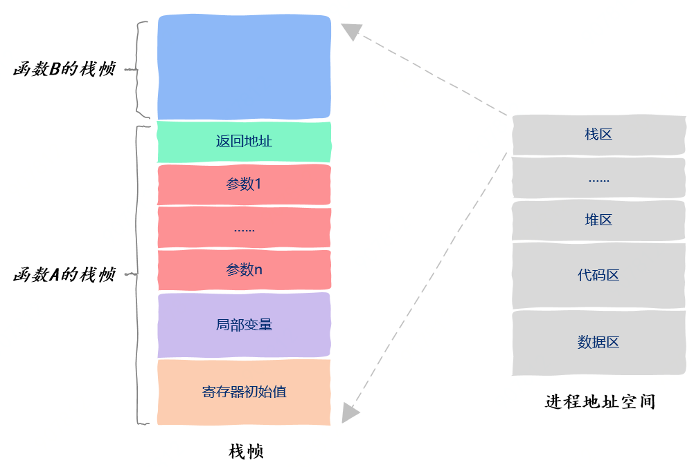

## Start

这里是一些自己对进程线程以及协程的学习记录和思考，如有错误还望指正。

进程，线程，协程这三者可以说是计算机领域，亦或者是面试题中最常遇到的部分了，在许多次的面试中多多少少回答了一些内容，但是大多都不是系统性的，且缺乏一定的深度。因此有了这篇文章，算是努力写一篇较为系统的学习笔记吧。~~希望下次面试的时候我能记起写在这里的内容，悲......~~

## 基础概念

在现代操作系统中（例如windows，linux等基于分时系统设计的操作系统），常有的观念是

> 一个程序至少包含一个进程，而一个进程又至少包含一个线程。线程是程序真正的执行单元。

线程与进程的调度控制由操作系统决定。在现如今的多核CPU情况下，多数时候是一个核心可以同时“并行”两个线程。因此常可以听到类似“这个cpu是双核四线程”这种描述。然而需要注意的是这里的“并行”是打引号的。因为实际上CPU的核心只可以顺序执行一系列的机器指令，且在早期的CPU设计中，一个核心同一时刻只可以运行一个线程。

Intel在2022年推出了“超线程（Hyper-Threading）技术”，这一技术的出现使得CPU可以实现“单个核心双线程”。简单的理解这个技术就是单线程时代的CPU实际上在单个时间片内是有处理能力冗余的，因此Intel为单个核心额外添加一小部分资源就可以实现同时运行第二个线程。

到目前为止我们讨论了的是现代基于分时系统设计的操作系统，然而其实在早期的计算机设计中（例如早期的UNIX,linux 2.4以及更早的版本中），进程（Process）才是程序的基本执行单元。(当然那个时候也还没有线程这个概念)

不过实践上，不论是进程Process还是线程Thread都是人们对于计算机科学中计算资源调度组织的一种设计概念，它们也可以换个名字例如Jobs,例如tasks。甚至由于中文的博大精深有些语境下进程和线程会是一个意思。当然人们可能更加愿意约定俗成的使用进程Process,线程Thread来指代它们。

说了这么多似乎感觉遗漏了协程Coroutine？

其实之所以拖到现在是因为协程Coroutine和进程Process以及线程Threading是完全不同的存在。进程和线程在现代操作系统中是能找到设计实现的，而协程则更像是依托于进程和线程这二者构建的基地而实现的一种调度方式。

相较于线程这种“抢占式多任务”由操作系统本身决定切换时机，协程则要求运行中的每一个执行单元定期放弃自己的执行权力，同时告知作业系统可以调度下一个执行单元。

在实际的应用实现中，线程进程是操作系统提供的接口，而协程更多的是编程语言本身对进程线程调度的优化实现（即线程进程的调度系统是操作系统本身，而协程的调度系统是由编程语言本身依靠操作系统进程线程特性实现的）。例如python以及go语言中对于协程的设计。更加具象化一点说：你可以在操作系统里找到进程ID,线程ID但是找不到协程ID.

> 总结: 在现代计算机中，一个程序至少包含一个进程，一个进程又至少包含 一个线程。线程是操作系统的最小执行单元。协程是依靠进程线程特性而设计出的一种调度方法。

在接下来的文章中为了避免中文语境下的混淆，我们规定进程即Process,线程即Thread, 协程即Coroutine.

## 进程线程之间的关系

### 生命周期
在上一篇章中我们简单的讲了进程与线程之间的关系：一个进程至少包含一个线程。但是实际上线程与进程的关系更复杂一些，尤其是对于各种计算机资源，IO,内存等上面。

线程与进程的生命周期类似（因为本质上进程运行的过程中本质是运行进程中的线程）所以他们都具有类似的生命周期：
1. 创建created
2. 就绪ready
3. 运行running
4. 等待waiting
5. 终止terminated

进程创建成功created并得到许可admitted后会进入到“就绪ready”状态等待“调度器scheduler”调度指派运行进入到“运行running”状态。在运行状态中也可以通过操作系统“中断interrupt”再次回到“就绪ready”状态。

在运行running过程中可能因为需要IO资源亦或是某些事件等进入“等待waiting”状态，在等待过程中调度器会去执行其他进入“就绪ready”状态的进程。在等待结束后进程又会进入“就绪ready”状态等待调度器调度。当然最终在运行过程中也可以满足某些条件退出exit,并进入最终终止terminated状态。


### 内存层面

进程具有自己独立的进程空间，进程空间内包含基本的数据区，代码区，堆空间和栈。进程所拥有的代码，全局变量，以及打开的文件信息IO句柄，动态链接库等。以上都是进程内的线程们所共享的。

在实际的开发过程中，线程的创建往往是定义一个函数体，然后将这个函数体传给操作系统提供的线程创建函数中以运行调度。

所以其实在内存层面来说，线程就像一个函数体一样有自己的内存栈。栈内维护了一系列的局部变量，寄存器，以及返回地址等。这些数据一起存放在整个进程地址空间的栈区。而进程地址空间内其他的区域包括堆区，代码区，数据区也就是我们常说的线程共享的进程内存空间。反应到代码里就是一些全局变量以及手动分配的在堆上的变量。



由于CPU的指令执行信息实际上是保存在一个寄存器中的，而之前说的每个线程都有自己独立的寄存器，所以操作系统可以很方便的从这个寄存器中得知线程在哪里被暂停，并继续运行。

此外虽然设计上来说线程共享进程的内存空间，但是线程与线程之间彼此独立。但是不代表线程之间就完全无法访问彼此的变量。例如：

```
void thread(void* var) {
    int* p = (int*)var;
    *p = 2;
}

int main() {
    int a = 1;
    pthread_t tid;

    pthread_create(&tid, NULL, thread, (void*)&a);
    return 0;
}
```
如上的函数在main函数中定义了一个变量a,并将a的地址传入给子线程并修改了这个变量的内容。

所以线程与线程之间并不是完全隔离的，这点与进程与进程之间的情况截然不同，进程与进程之间的隔离就严格多了，在现代操作系统中还有一些额外的安全设计来禁止进程之间的直接内存访问。例如进程的地址空间实际上都是虚拟地址空间并不代表实际的物理地址，在32位系统下一个进程的（虚拟）内存空间是4G,这些内存空间通过页表映射到实际的物理地址。（当然 64位下虚拟内存空间的大小会大很多，而且起内部的结构也与32位有差异）

### 线程局部存储

这是一个用于实现线程似有数据的技术 TLS, Thread Local Storage。

* 存放在该区域的变量是全局变量所有的线程都可以访问。
* 尽管所有线程访问的似乎是很同一个变量，但是在变量在一个线程访问过程中仅属于该线程，该线程对此变量的修改对其他线程不可见。

举例以下是一段C++ 11标准的代码
```
int a = 1; // 全局变量

void print_a() {
    cout<<a<<endl;
}

void run() {
    ++a;
    print_a();
}

void main() {
    thread t1(run);
    t1.join();

    thread t2(run);
    t2.join();
}
```
两个线程轮流对全局变量a进行+1操作，其最终输出结果如下
```
2
3
```
但如果对a变量的声明稍加修改为如下形式
```
__thread int a = 1;
```
其输出结果就会变成如下内容:
```
2
2
```
线程局部存储可以让你使用一个独属于线程的全局变量。该变量可以被所有的线程访问，且在每个线程中都有一个副本，一个线程对变量的修改不会影响其他的线程。

## 操作系统层面的进程和线程


